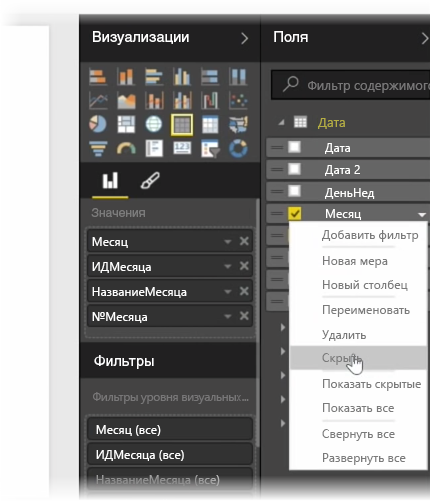
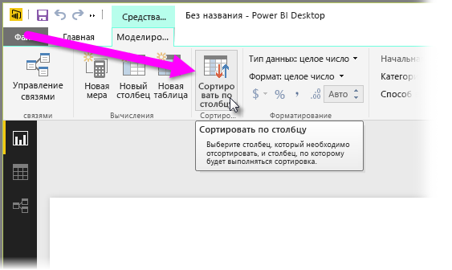
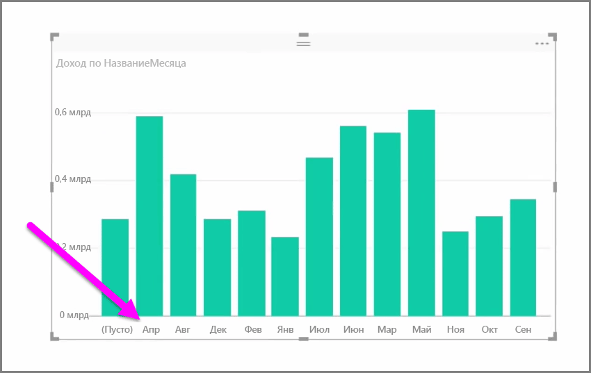
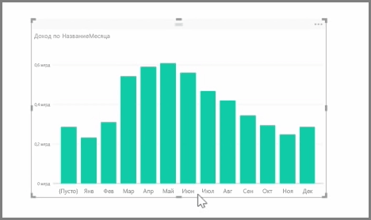

Импортированные данные часто содержат поля, которые на самом деле не нужны для задач создания отчетов и визуализаций, так как это либо лишняя информация, либо эти данные уже есть в другом столбце. В Power BI Desktop есть инструменты, позволяющие оптимизировать данные и сделать их более пригодными для создания отчетов и визуальных элементов, а также для просмотра общих отчетов.

## Скрытие полей
Чтобы скрыть столбец в области **Поля** Power BI Desktop, щелкните его правой кнопкой мыши и выберите пункт **Скрыть**. Обратите внимание, что скрытые столбцы не удаляются. Если вы использовали это поле в существующих визуализациях, то данные никуда не исчезнут, и их по-прежнему можно будет использовать в других визуализациях. Скрытое поле просто исчезнет из области **Поля**.

При просмотре таблицы в представлении **Связи** скрытые поля обозначаются серым цветом. Опять же, их данные по-прежнему доступны и являются частью модели, они просто скрыты от просмотра. Любое поле, которое было скрыто, всегда можно отобразить, щелкнув его правой кнопкой мыши и выбрав пункт **Показать**.

## Сортировка данных визуализации по другому полю
Инструмент **Сортировка по столбцу**, доступный на вкладке **Моделирование**, очень удобен для отображения данных в нужном порядке.

Распространенный пример: данные, которые включают в себя название месяца, сортируются в алфавитном порядке по умолчанию, и, например, "Август" отображается раньше, чем "Февраль".

В этом случае можно устранить проблему, выбрав поле из списка "Поля", выбрав **Сортировка по столбцу** на вкладке **Моделирования** вкладку, а затем выбрав поля для сортировки. В этом случае параметр сортировки категории "№Месяца" позволит правильно упорядочить месяцы.

Задание типа данных поля — еще один способ оптимизировать данные для правильной обработки. Чтобы изменить тип данных на холсте отчета, выберите столбец в области **Поля**, а затем в раскрывающемся меню **Формат** выберите один из параметров форматирования. Все созданные вами визуализации, отображающие это поле, будут обновлены автоматически.

