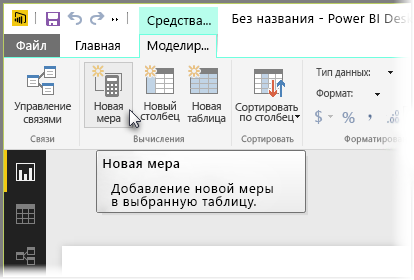
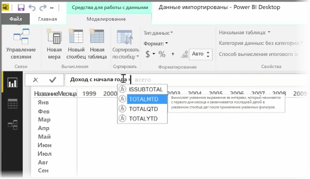
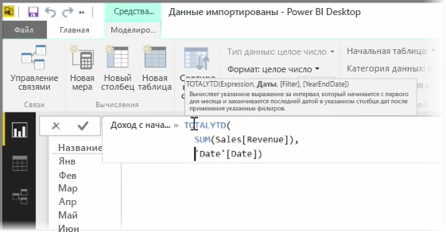
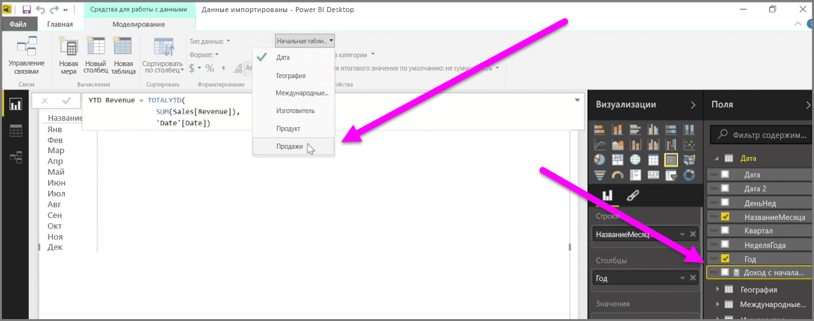

*Мера* — это вычисление, которое существует в модели данных Power BI. Для создания меры в представлении **отчетов** на вкладке **Моделирование** выберите **Создать меру**.

Замечательной особенностью DAX (языка выражений анализа данных в Power BI) является наличие множества полезных функций, особенно вычислений на основе времени, таких как *С начала года* или *По годам*. С помощью языка DAX можно один раз определить меру времени, а затем разделить ее на столько разных полей, сколько требуется для модели данных.

В Power BI определенное вычисление называется *мерой*. Для создания *меры* на вкладке **Главная** выберите **Создать меру**. Откроется строка формул, в которой можно ввести выражение DAX, определяющее эту меру. По мере ввода Power BI предлагает соответствующие функции DAX, а при вводе вычислений — поля данных. Также отображаются всплывающие подсказки, поясняющие некоторые параметры синтаксиса и функций.

Если вычисление особенно длинное, в редакторе выражений можно добавить дополнительные разрывы строк, нажав сочетание клавиш **ALT + ВВОД**.

После создания новой меры она отобразится в одной из таблиц в области **Поля**, которая находится в правой части экрана. Power BI вставляет новую меру в любую таблицу, которая в данный момент выбрана. Где бы она не размещалась в ваших данных, ее можно легко переместить, выбрав эту меру и воспользовавшись раскрывающимся меню **Домашняя таблица**.

Меру можно использовать, как любой другой столбец таблицы: просто перетащите ее на холст отчетов или в поля визуализации. Меры также легко интегрируются со срезами, оперативно разделяя данные на сегменты. Это означает, что меру можно определить один раз, а затем использовать во многих различных визуализациях.

Функция DAX **Calculate** — это мощный инструмент, позволяющий реализовывать все виды полезных вычислений, что особенно удобно применять в финансовой отчетности и визуальных элементах.

