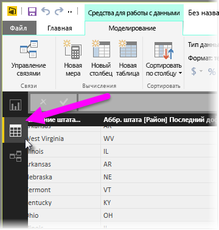
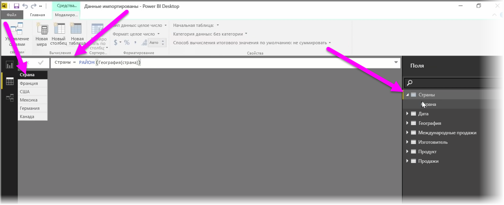

Вычисляемые таблицы — это функция DAX, позволяющая реализовать целый ряд новых возможностей моделирования. Например, если требуется выполнить различные типы соединений слиянием или оперативно создать новые таблицы на основе результатов функциональной формулы, вычисляемые таблицы помогут это сделать.

Чтобы создать вычисляемую таблицу, в Power BI Desktop в левой части холста отчетов перейдите в **Представление данных**.

На вкладке "Моделирование" выберите **Создать таблицу**, чтобы открыть строку формул.

Слева от знака равенства введите имя новой таблицы, а справа введите вычисление, которое вы хотите использовать для формирования этой таблицы. После завершения ввода вычисления в области полей модели появится новая таблица.

Когда вычисляемая таблица создана, ее можно использовать как любую другую таблицу в связях, формулах или отчетах.

