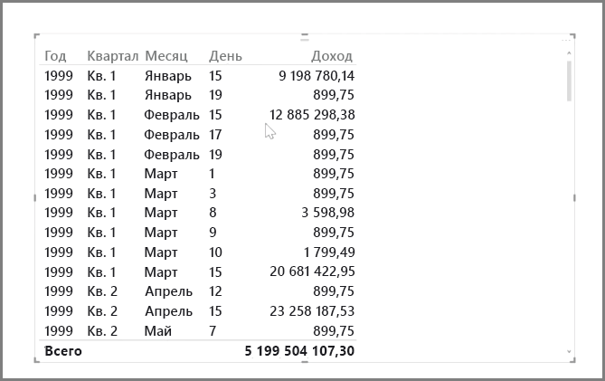
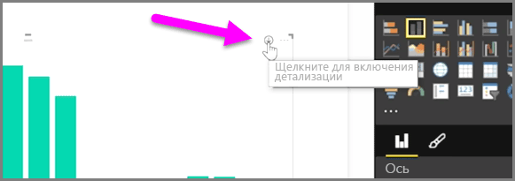
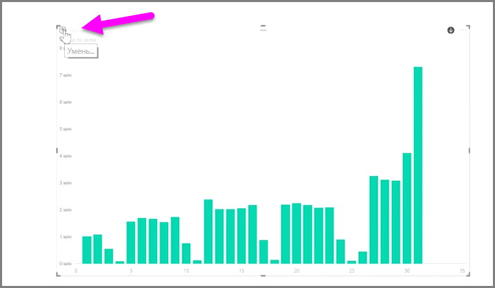
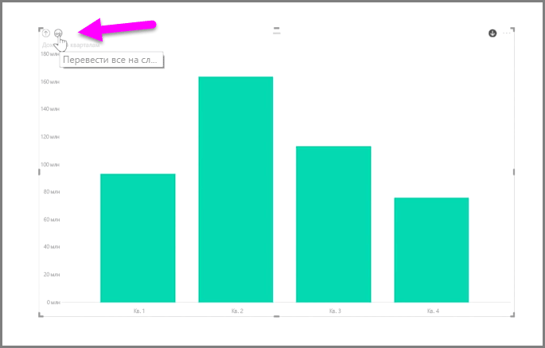
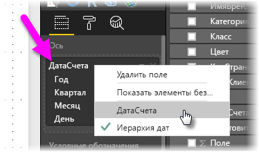
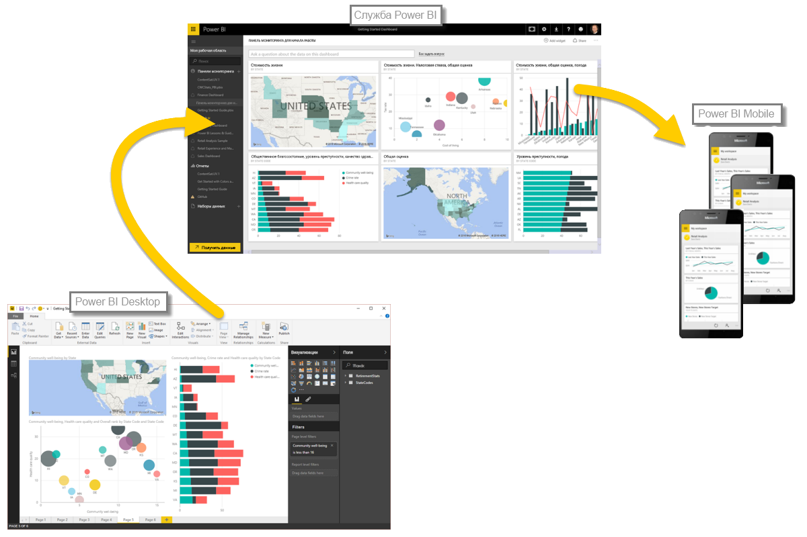

С помощью Power BI легко анализировать данные на основе времени. Инструменты моделирования в Power BI Desktop автоматически включают созданные поля, которые позволяют нажатием одной кнопки детализировать данные по годам, кварталам, месяцам и дням.  

При создании визуализации таблицы в отчете с использованием поля даты Power BI Desktop автоматически включает распределение по периодам времени. Например, служба Power BI автоматически разделила одиночное поле дат в таблице **Даты** на год, квартал, месяц и день, как показано на следующем рисунке.

По умолчанию визуализации отображают данные на уровне *года*, но это можно изменить, включив в правом верхнем углу визуального элемента **детализацию**.

Теперь при нажатии на столбцы или строки в диаграмме выполняется детализация до следующего уровня временной иерархии, например из уровня *годы* до уровня *кварталы*. Можно продолжить выполнение детализации, пока не будет достигнут предельный уровень иерархии, который в данном примере — *дни*. Чтобы вернуться на предыдущий уровень временной иерархии, щелкните значок **уменьшения детализации** в левом верхнем углу визуального элемента.

Также можно детализировать сразу все данные, отображаемые в визуальном элементе, а не только за один выбранный период. Для этого щелкните значок **детализации всех данных** (с двумя стрелками), который также расположен в верхнем левом углу визуального элемента.

Так как модель содержит поле дат, Power BI автоматически создаст различные представления для различных временных иерархий.

Чтобы использовать отдельные даты вместо иерархии дат, в области **полей** щелкните имя столбца правой кнопкой мыши (на изображении ниже имя столбца — *InvoiceDate*), а затем во всплывающем меню выберите имя столбца вместо **иерархии дат**. Затем в визуализации отобразятся данные на основе данных этого столбца без иерархии дат. Нужно вернуться к иерархии дат? Просто щелкните правой кнопкой мыши еще раз и в меню выберите **Иерархия дат**.

## Дальнейшие действия
**Поздравляем!** Вы изучили этот раздел курса **интерактивного обучения** для Power BI. Теперь, когда вы знакомы с *моделированием* данных, можете изучить другие интересные возможности в следующем разделе: **Визуализации**.

Как уже упоминалось, этот курс позволяет получить знания, выполняя следующий общий поток работы в Power BI:

* перенос данных в **Power BI Desktop** и создание отчета;
* публикация в службе Power BI, в которой можно создавать новые **визуализации** и информационные панели;
* **совместное использование** информационных панелей вместе с другими пользователями, в частности с теми, кто находится в пути;
* просмотр общих информационных панелей и отчетов, а также взаимодействие с ними в приложениях **Power BI Mobile**.

Даже если вы не выполните всю эту работу, у вас будет *понимание* того, как эти информационные панели созданы и как они подключены к данным. По завершении этого курса вы сможете создать собственную информационную панель.

До встречи в следующем разделе!

