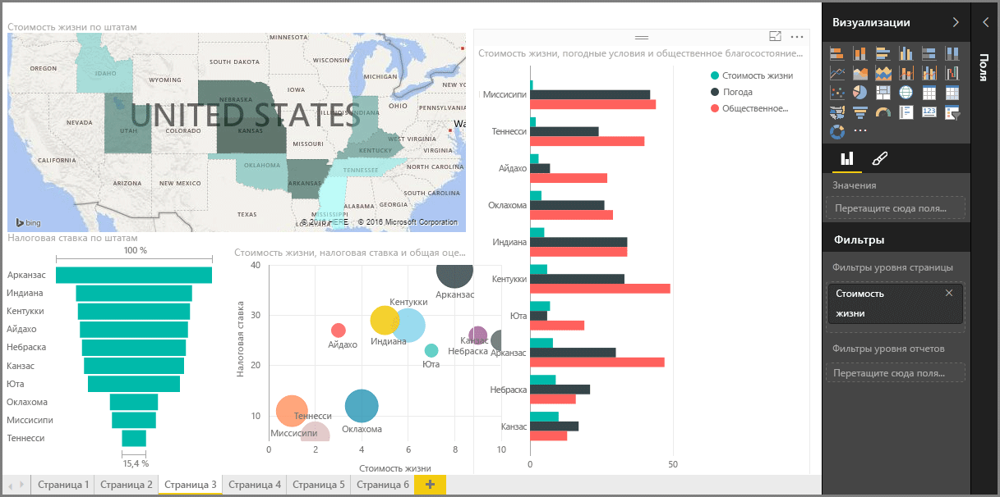

Добро пожаловать в раздел **Визуализации** курса **интерактивного обучения** для Power BI. Подготовьтесь к интересному и познавательному знакомству со множеством визуализаций, предлагаемых Power BI. И это еще не все — дополнительные визуализации будут предоставляться постоянно!

Разумеется, визуальные элементы являются конечным результатом любой задачи бизнес-аналитики. Мы хотим получить данные, представить их в привлекательной и информативной форме и *выделить* важные моменты. И в Power BI есть самые разные захватывающие визуальные элементы, а также практически неограниченные возможности по их настройке, так что это важный раздел.

Может показаться, что в этом разделе много подразделов, но не волнуйтесь: все подразделы краткие, они заполнены визуальными элементами (вы угадали) и легко запоминаются. Скорее всего, вы будете просматривать этот раздел и представлять, как ваши данные будут выглядеть в этих визуальных элементах.

Мы начнем с основ визуализаций — простых визуальных элементов, которые нам всем знакомы, — и вы узнаете все подробности. Затем мы перейдем к более сложным, или хотя бы менее распространенным, визуальным элементам и наполним ваш инструментарий для создания отчета.

Желаем успехов! Здесь можно многому научиться.

## Общие сведения о визуальных элементах в Power BI
Визуализация данных является одной из основных составляющих Power BI. Это основной стандартный блок, как было определено ранее в этом курсе, и создание визуальных элементов — самый простой способ находить аналитические данные и делиться ими.

В Power BI имеется целый ряд доступных по умолчанию визуализаций, от простых гистограмм до круговых диаграмм и карточек, и даже более экзотические предложения, например каскадные диаграммы, воронкообразные диаграммы, датчики и многое другое. Power BI Desktop также предоставляет множество средств для форматирования страниц, таких как фигуры и изображения, которые помогут воплотить отчет в жизнь.

