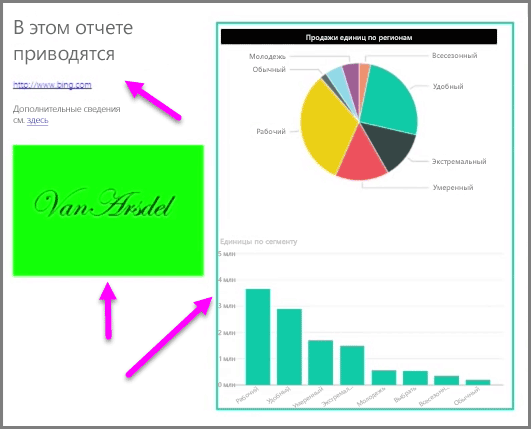

Кроме визуальных элементов с привязкой к данным для лучшего визуального оформления в отчеты можно также добавлять статические элементы, такие как текстовые поля, изображения и фигуры. Чтобы добавить визуальный элемент, не вкладке **Главная** выберите **Текстовое поле**, **Изображение** или **Фигуры**.

**Текстовые поля** — это идеальный способ отображения крупных названий, заголовков или коротких фрагментов текста, сопутствующих визуализациям. Текстовые поля могут содержать ссылки, которые отображаются в виде URL-адреса или как привязка к фразе, которую необходимо выделить и выбрать символ ссылки на панели параметров текстового поля. URL-адреса можно включать в текстовые поля, и служба Power BI автоматически определит ссылку и сделает ее активной.

Если выбрать **Изображение**, то откроется браузер файлов, в котором можно выбрать изображение с компьютера или другого сетевого источника. По умолчанию при изменении в отчете размера изображения будут сохраняться пропорции, но это можно отключить в параметрах визуального форматирования.

**Фигуры** имеют пять вариантов форм, включая прямоугольники и стрелки. Фигуры могут быть прозрачными или непрозрачный, а также иметь цветную рамку. (Последний параметр можно использовать для создания рамок вокруг групп визуализаций.)

