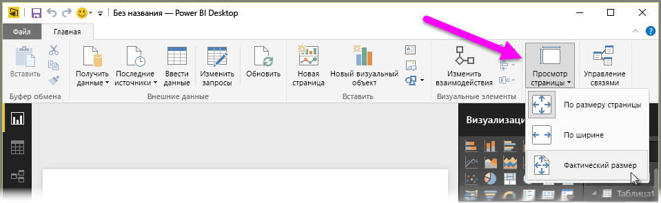
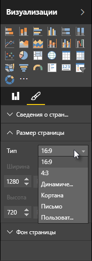

Power BI Desktop дает возможность управлять макетом и форматированием страниц отчета, например, изменить их размер и ориентацию.

Используйте меню **Просмотр страницы** на вкладке "Главная", чтобы изменить способ масштабирования страниц отчета. Доступны следующие параметры: **По размеру страницы** (по умолчанию), **По ширине** и **Фактический размер**.

Можно также изменить размер самой страницы. По умолчанию страницы отчета имеют соотношение сторон 16:9. Чтобы изменить размер страницы, убедитесь, что не выбран ни один визуальный элемент, а затем щелкните значок кисти в области "Визуализации" и щелкните **Размер страницы**, чтобы развернуть данный раздел.

Доступны следующие параметры размера страницы: "4x3" (более квадратное соотношение сторон) и "Динамический" (страница будет заполнять все доступное место). Кроме того, для отчетов доступен стандартный размер Letter. Помните, что после изменения размера страницы может потребоваться изменить размер визуальных элементов, чтобы они были полностью видны на холсте.

Можно также указать пользовательский размер страницы, установив его в дюймах или пикселях, и изменить цвет фона всего отчета.

Кроме того, можно выбрать параметр "Кортана", который изменяет размер отчета так, чтобы он мог использоваться для результатов поиска с помощью Кортаны.

