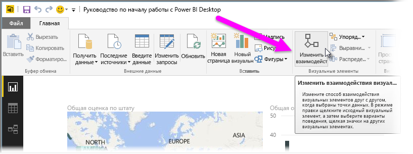
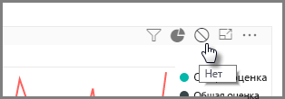
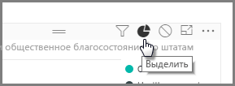
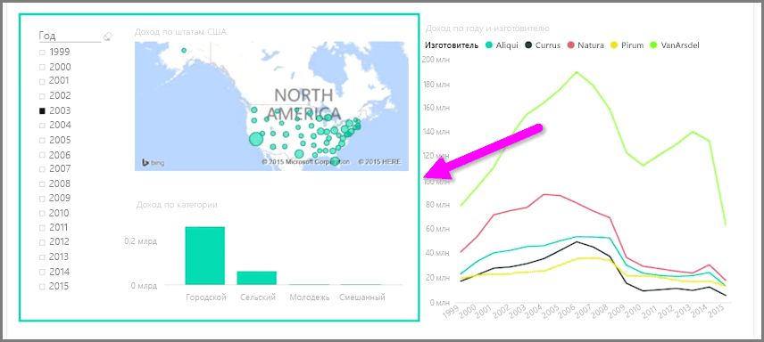

При наличии нескольких визуализаций на одной странице отчета выбор определенного сегмента щелчком мыши или с помощью среза повлияет на все визуальные элементы на этой странице. Однако в некоторых случаях может потребоваться разбивать только определенные визуальные элементы. В первую очередь это касается использования точечных диаграмм, в которых ограничение данных определенными сегментами нарушит критически важное значение. К счастью, Power BI Desktop позволяет контролировать поток взаимодействия между визуальными объектами.

Чтобы изменить взаимодействие между визуализациями, на ленте **Главная** в разделе "Визуальные элементы" выберите **Изменить** и переключитесь в **режим изменения**.

>[!NOTE]
>С момента записи видео значок **Изменить взаимодействия** в Power BI Desktop изменился.
> 
> 

При выборе визуального элемента на холсте отчетов в правом верхнем углу каждого визуального элемента, на который он влияет, отображается маленький, непрозрачный значок *фильтра*. Чтобы отключить взаимодействие для визуального элемента, в правом верхнем углу рядом со значком *фильтра* щелкните символ *Отсутствует*.

В некоторых случаях тип фильтра взаимодействий между визуальными элементами можно настроить. Переключитесь в **режим изменения** и выберите визуальный элемент, который необходимо использовать для фильтрации. Если тип взаимодействия для другого визуального элемента можно изменить, в правом верхнем углу рядом со значком фильтра появится значок *круговой диаграммы*.

Щелкните значок *круговой диаграммы*, чтобы выделить сегментированные данные. В противном случае данные будут отфильтрованы. Чтобы удалить все взаимодействия, снова щелкните символ *Отсутствует*.

Кроме того, стоит также нарисовать вокруг визуальных элементов, которые взаимодействуют между собой, прозрачную фигуру. Таким образом пользователи смогут определять текущие связи.

