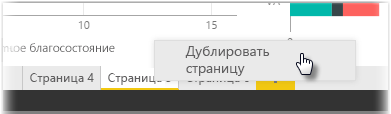

Отдельные страницы отчетов могут быть довольно сложными, с множеством визуализаций, которые взаимодействуют между собой определенным образом и имеют точное форматирование. Иногда при построении отчета может потребоваться использовать одинаковые визуальные элементы или макеты для двух разных разделов отчета. Например, если вы собрали на одной странице отчета данные по валовому доходу, то вам может потребоваться почти такая же страница для чистого дохода.

Проделать всю эту работу повторно было бы сложно, но Power BI Desktop позволяет просто дублировать страницу отчета.

Щелкните правой кнопкой мыши вкладку, которую необходимо скопировать, и выберите **Дублировать страницу**.

Затем можно ввести имя новой вкладки страницы, обновить текст заголовка, если он имеется, а также обновить визуальные элементы, добавив новое поле, которое требуется отслеживать.

