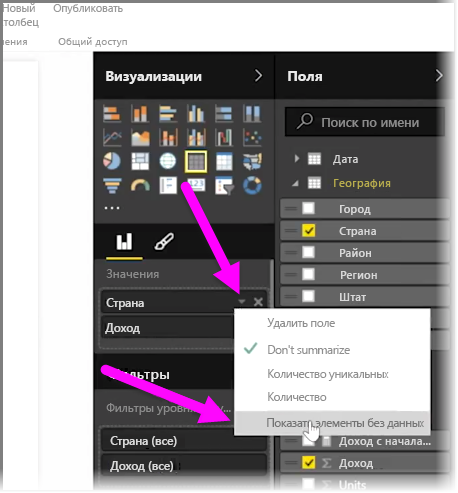
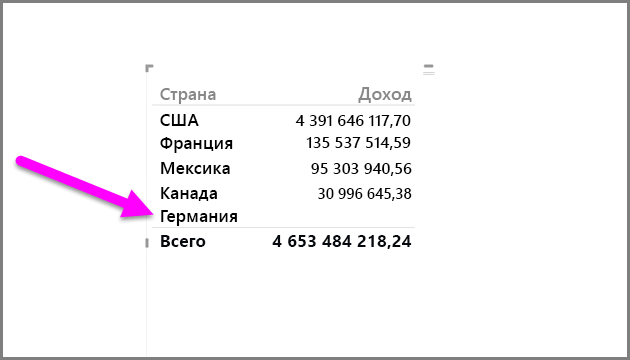
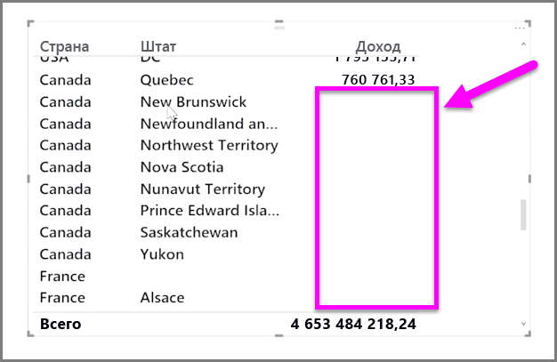

По умолчанию заголовки столбцов отображаются в отчетах, только если эти столбцы содержат данные. Например, если вы отображаете доход по странам, и в Норвегии не было продаж, то Норвегия не будет отображаться в визуализации.

Чтобы отобразить пустые категории, в области **Визуализации** щелкните стрелку вниз в поле, которое требуется изменить, и выберите **Показать элементы без данных**.

Теперь в визуализации появятся все пустые столбцы с пустыми значениями.

Если выбрать параметр **Показать элементы без данных** для любого поля в области **Визуализации**, он будет применен ко всем полям, отображаемым в области "Визуализации". Поэтому при добавлении другого поля все элементы, не имеющие данных, также будут показаны, и вам не придется еще раз воспользоваться раскрывающимся меню.

