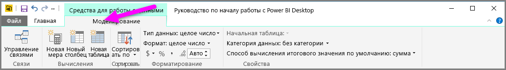
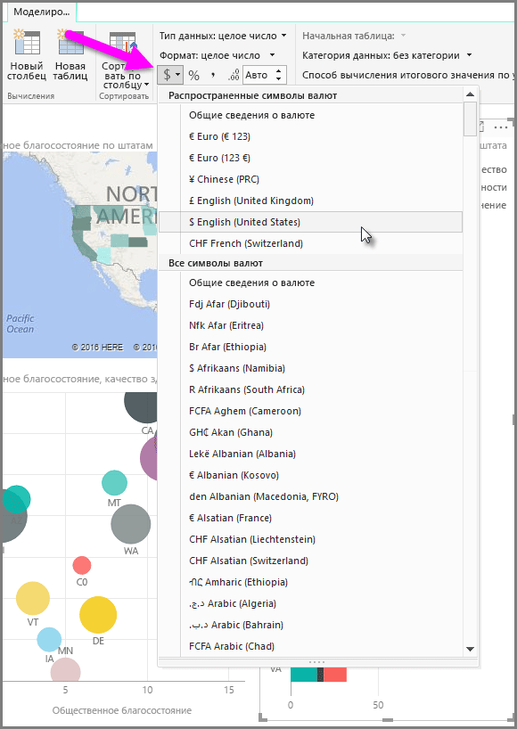
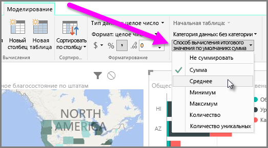
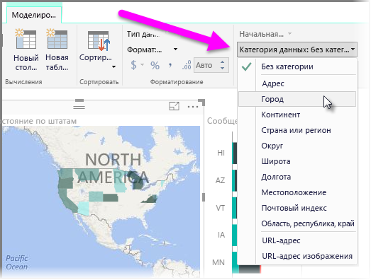

Power BI имеет свойства, которые можно назначать для полей в модели, что помогает создавать отчеты, визуализировать и представлять данные с большей наглядностью. Например, иногда требуется получить среднее значение для списка чисел, а Power BI автоматически их суммирует. С помощью Power BI можно настроить, каким образом будут формироваться сводные данные для таких списков чисел.

## Числовое управление при формировании сводных данных
Давайте рассмотрим пример и продемонстрируем, как настроить способ, с помощью которого Power BI формирует сводные данные на основе полей с числовыми данными.

На холсте отчетов выберите визуальный элемент, а затем в области **полей** выберите поле. В ленте появится вкладка **Моделирование**, на которой отображаются параметры форматирования и свойства данных.

Можно выбрать тип используемого обозначения денежной единицы. Для этого выберите раскрывающийся список обозначений денежных единиц, который показан на следующем рисунке.

Существует много различных параметров для форматирования полей. Например, можно изменить формат с денежной единицы на проценты.

Также можно изменить способ, используемый Power BI для вычисления итогового значения по данным. Выберите значок **Способ вычисления итогового значения по умолчанию**, чтобы изменить способ формирования сводных данных для поля, включая отображение суммы, количества или среднего значения.

## Управление и обеспечение наглядности данных расположения
Аналогичные изменения можно делать при нанесении расположений на карту. Выберите карту, а затем в области **полей** выберите поле, которое используется для значения *расположения*. На вкладке **Моделирование** выберите раздел **Категория данных**, а затем в раскрывающемся меню выберите категорию, которая представляет данные расположения. Например, выберите область, район или город.

