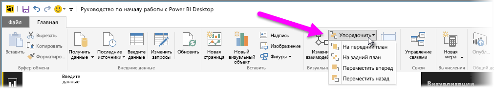
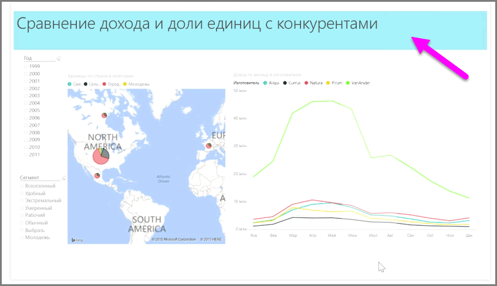

Если в отчете имеется большое количество элементов, Power BI позволяет управлять тем, как они перекрываются между собой. Принцип размещения элементов по уровням или один над другим часто называют z-порядком.

Чтобы настроить z-порядок элементов в отчете, выберите элемент и воспользуйтесь кнопкой **Упорядочить** на вкладке **Главная** ленты.

Используя пункты меню кнопки **Упорядочить**, можно получить именно такой порядок элементов в отчете, который вам необходим. Можно переместить визуальный элемент на один уровень вперед или назад, вывести все элементы на передний или задний план и т. д.

Кнопка "Упорядочить" особенно полезна при использовании фигур в качестве декоративного фона или рамок, а также для выделения определенных частей диаграммы или графика. Эти параметры также можно использовать для создания фона, например как этот голубой прямоугольник, используемый в качестве фона заголовка отчета.

