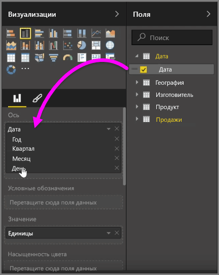
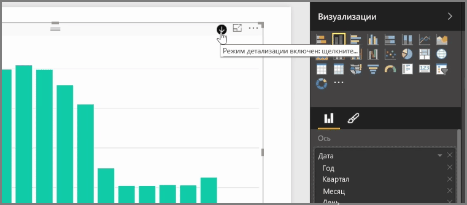
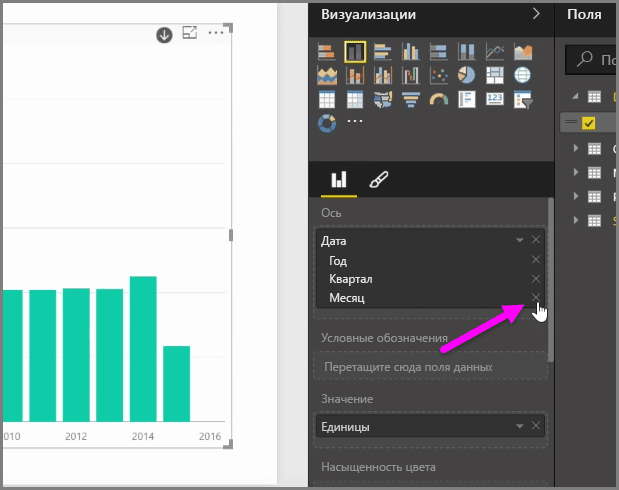
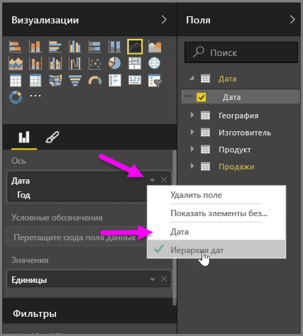
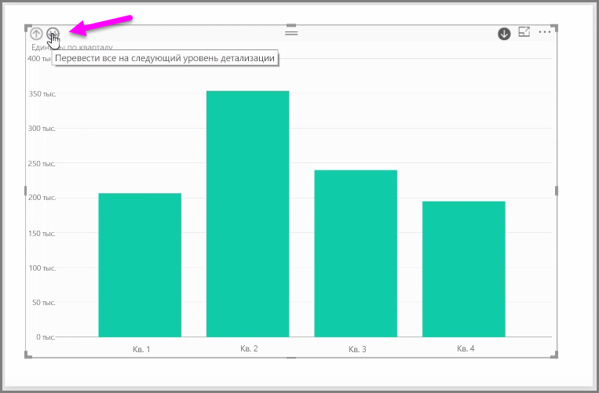

При добавлении поля *даты* в визуальный элемент в контейнер поля *Ось* Power BI автоматически добавляет иерархию времени, которая включает в себя *год*, *квартал*, *месяц* и *день*. Таким образом Power BI позволяет пользователям, просматривающим отчеты, работать с визуальными элементами на основе времени, детализируя данные до нужной временной шкалы.

При наличии иерархии можно детализировать данные по иерархии времени. Например, если щелкнуть год на диаграмме, данные будут детализированы до следующего уровня в иерархии — *кварталов*, которые будут отображены в визуальном элементе.

В этой автоматически созданной иерархии можно также задать, до какого уровня общего отчета пользователи могут детализировать данные. Для этого в области "Визуализации" просто щелкните X рядом с иерархией, которую требуется удалить. Удаленные уровень убирается из отчета и больше не отображается при детализации.

Если потребуется вернуть этот уровень иерархии, просто удалите поле *даты*, а затем снова добавьте его из области **Поля**, тогда иерархия вновь будет создана автоматически.

Возможны случаи, когда использовать иерархию в визуальном элементе не требуется. Вы можете управлять этой функцией, нажав кнопку со стрелкой вниз рядом с полем *даты* (после его добавления в визуальный элемент) и выбрав **Дата** вместо **Иерархия дат**. Тогда Power BI будет отображать необработанные значения даты в визуальном элементе.

Можно также развернуть сразу все видимые на экране элементы данных, а не выбирать один квартал или год. Для этого щелкните значок *детализации всех данных* в верхнем левом углу визуального элемента (это значок с двумя стрелкам и вниз).

