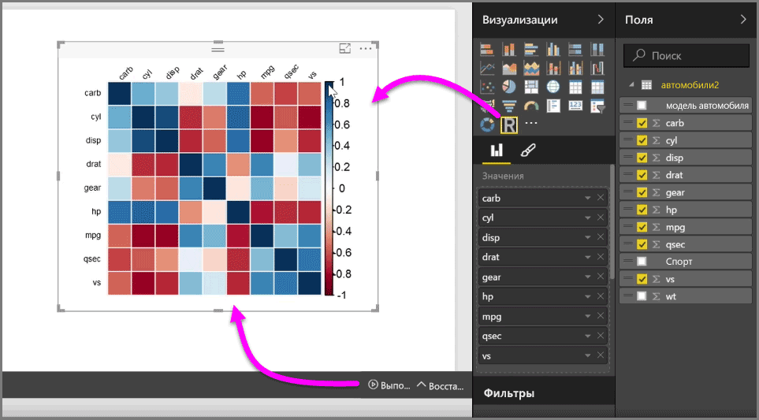
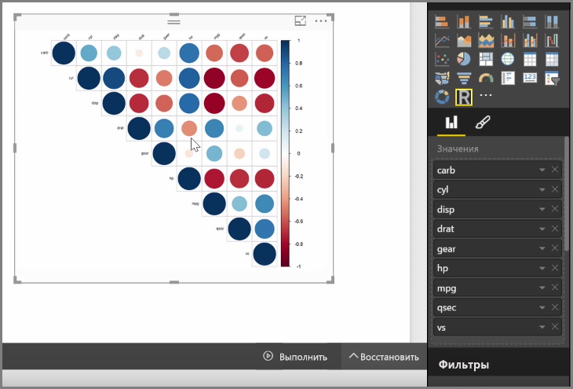

Power BI Desktop позволяет выполнять аналитический и статистический анализ и создавать привлекательные визуальные элементы, используя интеграцию с R. Эти визуализации R можно поместить в отчет Power BI Desktop.

При щелчке значка **Визуальный элемент R** в области **Визуализации** Power BI создает на холсте заполнитель для визуального элемента R, а затем справа на холсте открывает редактор сценариев R. При добавлении полей в визуальный элемент R Power BI Desktop добавляет их в область редактора сценариев R.

Под кодом, создаваемым Power BI в редакторе сценариев R, можно начать создание сценария R для формирования визуального элемента. Завершив сценарий, щелкните **Выполнить**, после чего произойдет следующее.

1. Данные, добавленные в визуальный элемент (из области **Поля**), отправляются из Power BI Desktop в локальный установленный экземпляр R.
2. Сценарий, созданный в редакторе сценариев R Power BI Desktop, выполняется в этом локальном установленном экземпляре R.
3. Затем Power BI Desktop возвращает визуальный элемент из установленного экземпляра R и отображает его на холсте.

Все это происходит очень быстро, и результат отображается в визуализации **Визуальный элемент R** на холсте.

Визуальный элемент R можно изменить, отредактировав сценарий R, а затем еще раз щелкнув **Выполнить**. На следующем рисунке мы изменили визуальный элемент для отображения кругов вместо квадратов.

И так как визуальный элемент R не отличается от других визуальных элементов Power BI Desktop, с ним можно взаимодействовать, а также подключать к другим визуальным элементам на холсте. При взаимодействии с другими визуальными элементами на холсте с применением фильтрации или выделения визуальный элемент R реагирует автоматически, как и любой другой визуальный элемент Power BI, и для этого не нужно настраивать сценарий R.

Это отличный способ использовать возможности R непосредственно в Power BI Desktop.

## Дальнейшие действия
**Поздравляем!** Вы завершили раздел **Визуализации** курса **интерактивного обучения** для Power BI. Можете считать, что вам известно о многих визуализациях, предлагаемых в Power BI, а также вы знаете, как их использовать, изменять и настраивать. А вот еще хорошие новости: визуализации в Power BI Desktop и службе Power BI мало чем отличаются, так что ваши знания применимы и там, и там.

Теперь вы готовы перейти к облаку и погрузиться в работу со службой Power BI, позволяющей **просматривать данные**. Как вы знаете, рабочий процесс выглядит примерно следующим образом:

* перенос данных в **Power BI Desktop** и создание отчета;
* публикация в службе Power BI, в которой можно создавать новые **визуализации** и информационные панели;
* **совместное использование** информационных панелей вместе с другими пользователями, в частности с теми, кто находится в пути;
* просмотр общих информационных панелей и отчетов, а также взаимодействие с ними в приложениях **Power BI Mobile**.

Не важно, создаете ли вы отчеты или только просматриваете и взаимодействуете с ними — теперь вы знаете, как создаются все эти интересные визуальные элементы и как они подключаются к данным. Далее мы посмотрим на эти визуальные элементы и отчеты в действии.

До встречи в следующем разделе!

