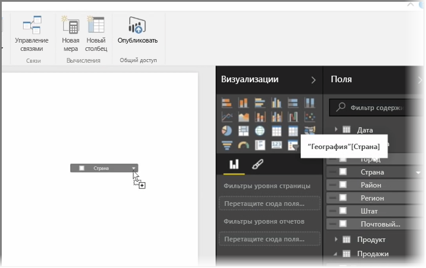
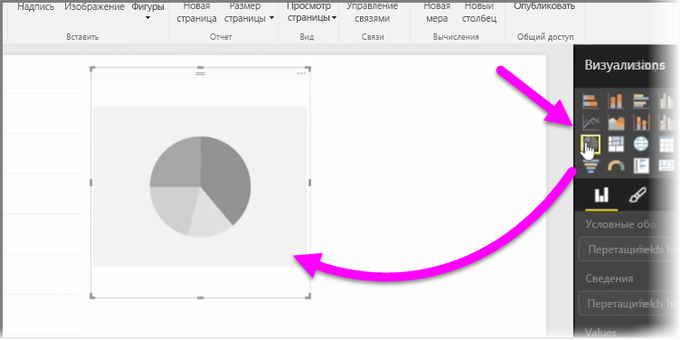
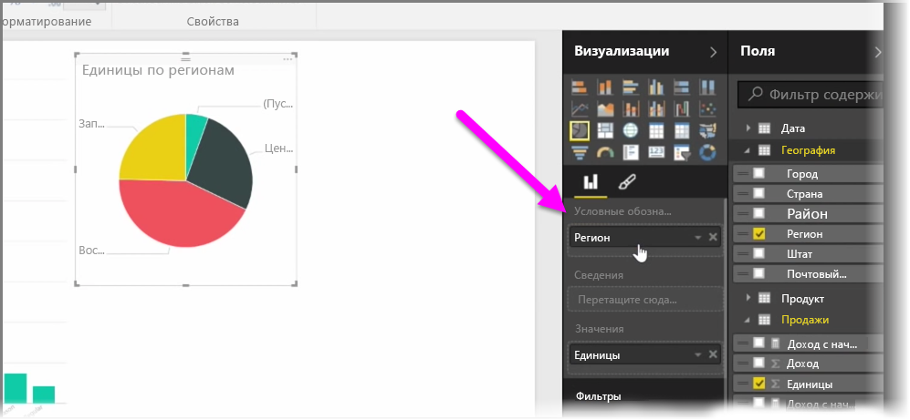
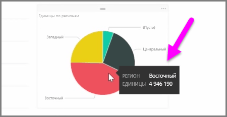
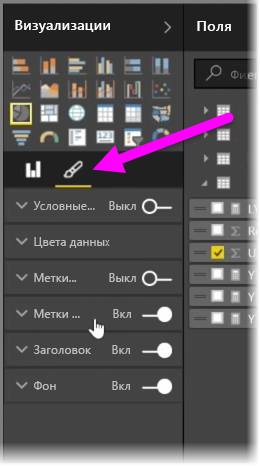

В этой статье вы узнаете, как создавать новые линейчатые, круговые диаграммы и диаграммы "дерево", а также как их настраивать для использования в отчетах.

Существует два различных способа создания новой визуализации в Power BI Desktop:

* Можно перетащить имена полей из области **Поля** на холст отчетов. По умолчанию визуализация отображается в виде таблицы данных.
  
  
* В области **Визуализации** также можно щелкнуть тип визуализации, который необходимо создать. При использовании этого метода визуальный элемент по умолчанию будет пустым заполнителем, который выглядит как выбранный вами тип визуального элемента.
  
  

После создания графика, карты или диаграммы можно начать перетаскивать поля данных в нижнюю часть области **Визуализации**, чтобы создать и упорядочить свой визуальный элемент. Доступные поля будут отличаться в зависимости от выбранного типа визуализации. По мере перетаскивания полей данных визуализация будет автоматически обновляться для отражения изменений.

Размер визуализации можно изменить, выбрав ее, а затем перетащив маркеры изменения размера. Кроме того, можно переместить визуализацию в любое другое место на холсте, щелкнув и перетащив ее. Для преобразования типа визуализации выберите визуальный элемент, который необходимо изменить, и просто выберите другой визуальный элемент из значков в области **Визуализации**. Power BI попытается преобразовать выбранные вами поля в новый тип визуального элемента настолько, насколько это возможно.

При наведении курсора на части визуализаций будет отображаться подсказка, содержащая сведения о сегменте, такие как метки и общие значения.

В области **Визуализации** выберите значок **кисти**, чтобы внести финальные изменения в визуальный элемент, например, выравнять фон, ввести текст заголовка или изменить цвета данных.

Доступные варианты финальных изменений визуального элемента зависят от выбранного типа визуального элемента.

