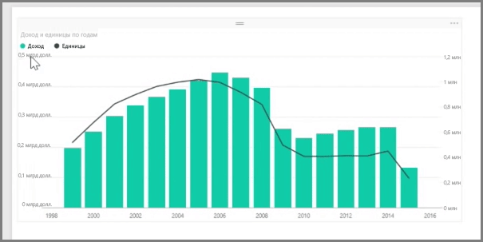
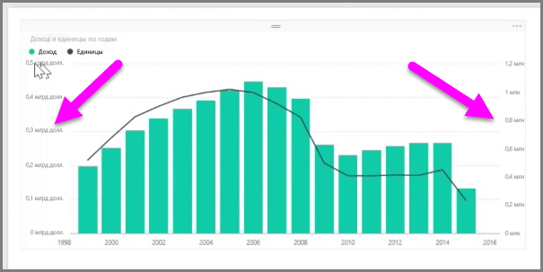
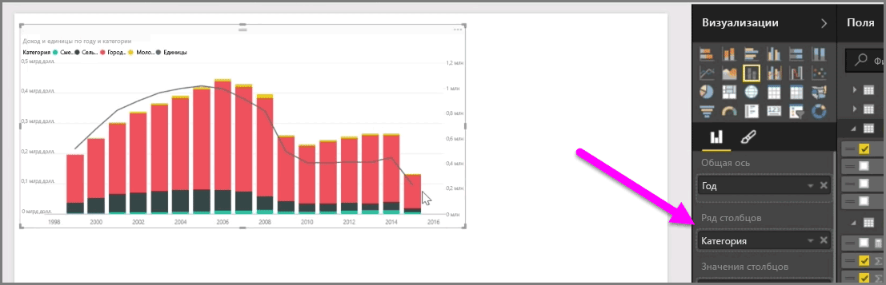

Если необходимо визуализировать две меры, имеющие совсем разные шкалы измерения, например доход и единицы товара, то очень полезной будет **смешанная диаграмма**, которая отображает данные в виде линии и столбцов с разными шкалами по оси. Power BI поддерживает множество разных типов смешанных диаграмм по умолчанию, в том числе популярные типы **График** и **Гистограмма с накоплением**.

При создании смешанной диаграммы будет предложено выбрать поле для **Общей оси** (оси X), а затем значения для двух полей, в данном случае — столбец и линия. Два условных обозначения для оси Y отображаются по разные стороны визуализации.

Также можно разделить каждый столбец по категориям, перетащив категории в поле "Ряд столбцов" в области "Визуализации". После этого каждый столбец будет пропорционально закрашен, исходя из значений в каждой категории.

Смешанные диаграммы — это эффективный способ отображения нескольких мер с очень разными шкалами измерения в одной визуализации.

