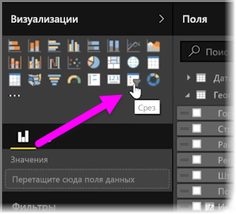
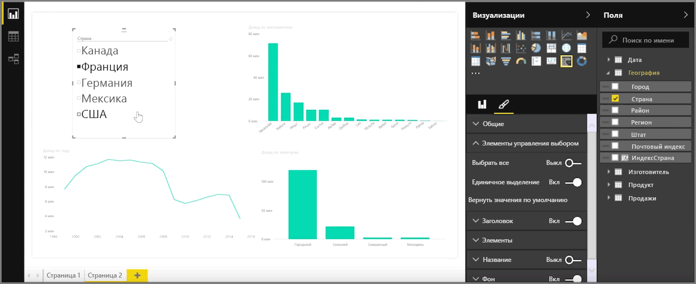
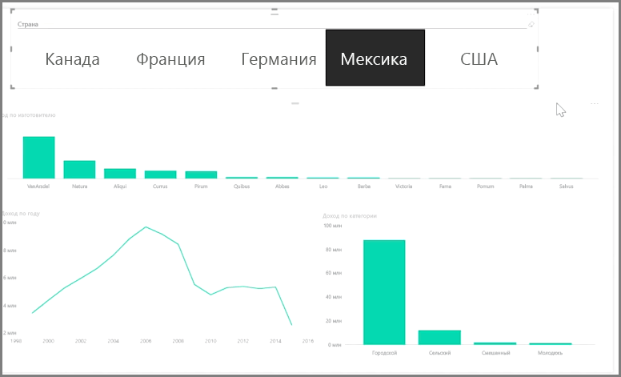

Срезы — это один из самых мощных типов визуализаций, особенно в составе бизнес-отчета. **Срез** — это фильтр визуального элемента на холсте в **Power BI Desktop**, который позволяет каждому, кто просматривает отчет, разбить данные на сегменты по определенному значению, например по годам или по географическому расположению.

Чтобы добавить в отчет срез, в области **Визуализации** выберите **Срез**.

Перетащите поле, по которому необходимо выполнить срез, и поместите его над заполнителем среза. Визуализация преобразуется в список элементов с флажками. Эти элементы являются фильтрами: установите флажок рядом с одним сегментом, и все визуализации на этой странице отчета отфильтруются, или *выполнят срез*, по выбранному сегменту.

Существует несколько доступных способов форматирования среза. Можно настроить одновременный прием нескольких входных значений или переключиться в режим **Единичное выделение**, чтобы значения принимались по одному. Также в элементы среза можно добавить параметр **Выделить все**, что очень удобно при наличии слишком длинного списка. Если изменить ориентацию среза с вертикальной (по умолчанию) на горизонтальную, то вместо контрольного списка получится строка выделения.

