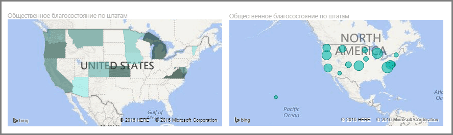
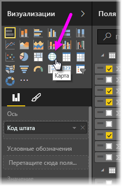
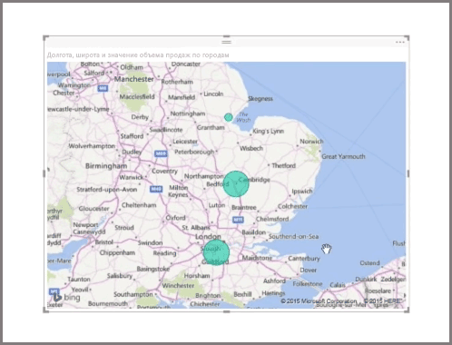
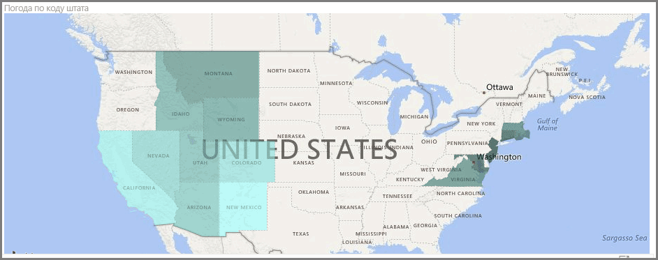
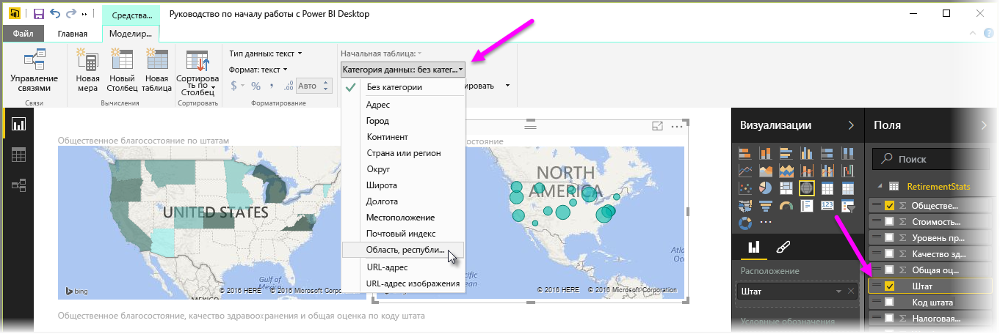

Power BI имеет два разных типа визуализаций карт: пузырьковая карта, которая помещает пузырек над географической точкой, и фигурная карта, показывающая очертания области, которую требуется визуализировать.

> [!NOTE]
> Указывая страны или регионы, используйте трехбуквенное сокращение для правильной работы геокодирования в визуализации карт. *Не* используйте двухбуквенные сокращения, так как некоторые страны или регионы могут не распознаваться правильно.
> Если у вас есть только двухбуквенные сокращения, в [этой внешней записи блога](https://blog.ailon.org/how-to-display-2-letter-country-data-on-a-power-bi-map-85fc738497d6#.yudauacxp) вы найдете инструкции о том, как связать двухбуквенные сокращения для обозначения стран и регионов с трехбуквенными.
> 
> 

## Создание пузырьковых карт
Чтобы создать пузырьковую карту, в области **Визуализации** выберите параметр **Карта**. В параметрах **визуализаций** необходимо добавить значение в контейнер *Расположение*, которое будет использоваться в визуальном элементе карт.

Служба Power BI позволяет принимать довольно разные типы значений расположения, от более общих, таких как название города или код аэропорта, до очень конкретных данных широты и долготы. Добавьте поле в контейнер **Размер**, чтобы соответствующим образом изменить размер пузырька для каждого расположения карты.

## Создание фигурных карт
Чтобы создать фигурную карту, в области "Визуализации" выберите параметр **Картограмма**. Как и с пузырьковыми картами, необходимо добавить какое-то значение в контейнер "Расположение", которое будет использоваться в этом визуальном элементе. Добавьте поле в контейнер "Размер", чтобы соответствующим образом изменить насыщенность цвета заливки.

Значок предупреждения в левом верхнем углу указывает на то, что для точного построения значений карте требуются дополнительные данные расположения. Эта проблема особенно часто возникает, когда данные в поле расположения являются неоднозначными, например, введено имя области *Washington* (Вашингтон), которое может обозначать штат или город. Одним из способов устранения этой проблемы является изменение имени столбца на более конкретное, такое как *State* (Штат). Другой способ ее устранения — вручную сбросить значение категории данных, выбрав на вкладке "Моделирование" раздел **Категория данных**. В этом разделе можно назначить категорию для данных, например "State" (Штат) или "City" (Город).

