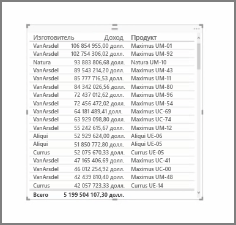
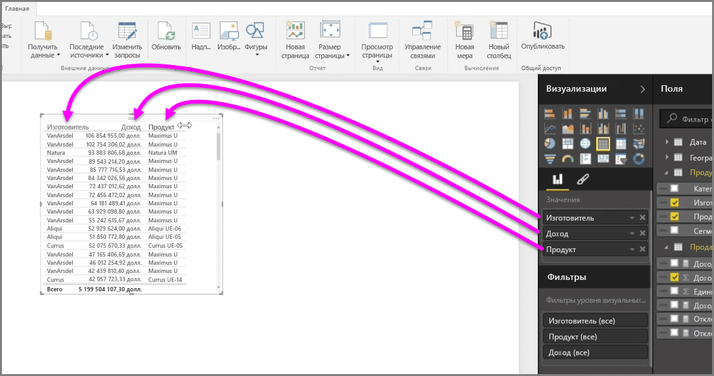
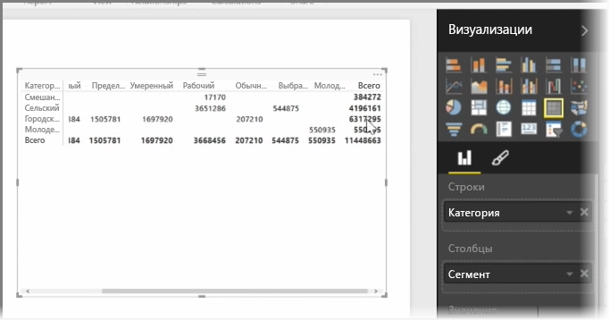

В дополнение к множеству диаграмм Power BI Desktop также поддерживает и другие табличные визуализации. На самом деле, когда вы перетаскиваете поле категории или текстовое поле на холст отчетов, по умолчанию получается таблица результатов. Можно прокрутить таблицу вверх и вниз. Изначально данные будут отсортированы в алфавитном порядке.

Если в таблице содержатся числовые данные, такие как сведения о доходе, то внизу будет отображаться общая сумма. Каждый столбец можно отсортировать вручную: если щелкнуть его заголовок, порядок сортировки меняется с возрастающего на убывающий и обратно. Если столбец недостаточно широкий для отображения всего содержимого, щелкните и растяните его в стороны, чтобы он стал шире.

Порядок полей в контейнере *Значения* в области **Визуализации** определяет порядок, в котором они отображаются в таблице.

**Матрица** похожа на таблицу, но имеет другие заголовки категорий в столбцах и строках. Как и в таблицах, числовые данные будут автоматически просуммированы внизу и вдоль правой стороны матрицы.

Для матриц доступно множество вариантов финальных изменений, таких как автоподбор размера столбцов, переключение между итогами строк и столбцов, настройка цветов и т. д. При создании матрицы убедитесь, что категориальные (нечисловые) данные располагаются слева от матрицы, а числовые файлы — справа. В таком случае появится горизонтальная полоса прокрутки, и прокрутка будет работать правильно.

