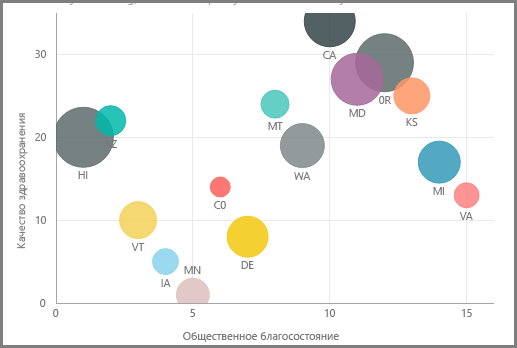
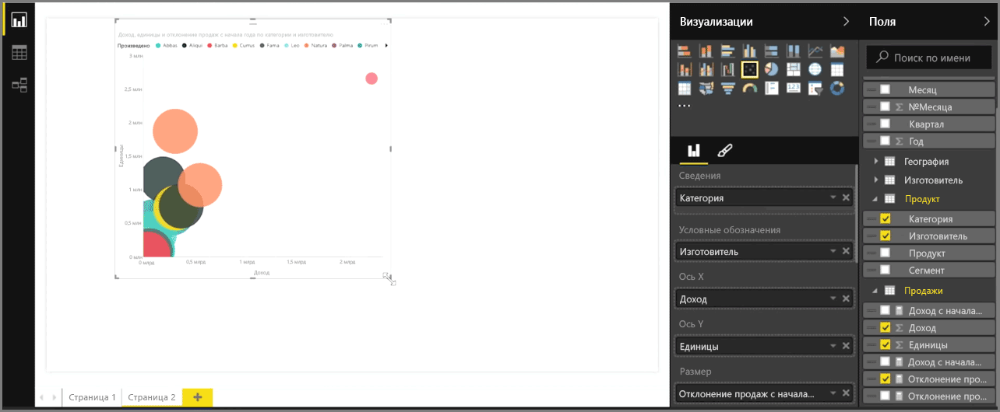
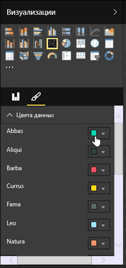
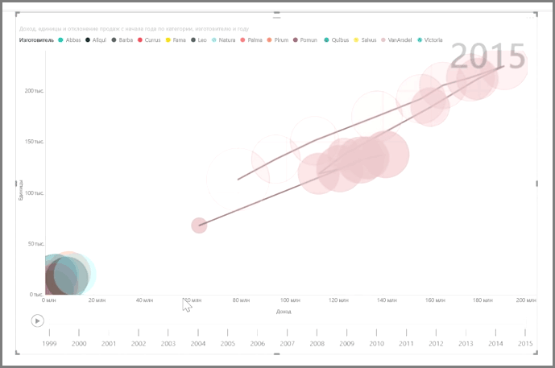

Если требуется сравнить две разные меры, такие как объем продаж и доход, то лучшей визуализацией будет точечная диаграмма.

Чтобы создать пустую диаграмму, в области **Визуализации** выберите вариант **Точечная диаграмма**. Из области **Поля** перетащите два поля, которые требуется сравнить, в контейнеры *Ось X* и *Ось Y*. На этом этапе ваша точечная диаграмма, скорее всего, выглядит просто как небольшой пузырек в центре визуального элемента. Теперь необходимо добавить меру в контейнер *Сведения*, чтобы указать, как разбивать данные на сегменты. Например, при сравнении объема продаж и дохода, возможно, потребуется разделить данные по категориям, производителям или по месяцам продаж.

Добавление дополнительного поля в контейнер *Условные обозначения* обозначает пузырьки цветом в соответствии со значением поля. Также можно добавить поле в контейнер *Размер*, чтобы изменить размер пузырьков в соответствии с этим значением.

Кроме того, точечные диаграммы имеют много параметров форматирования визуальных элементов, такие как включение контура каждого цветного пузырька и переключение отдельных меток. Цвета данных для других типов диаграмм также можно менять.

Можно создать анимацию, отображающую изменения в пузырьковой диаграмме за определенный период, добавив поле на основе времени в контейнер *Ось воспроизведения*. Во время анимации щелкните пузырек, чтобы просмотреть трассировку его пути.

>[!NOTE]
>Помните, что если на точечной диаграмме отображается только один пузырек, то это происходит потому, что Power BI выполняет статистическую обработку данных, и это — поведение по умолчанию. Чтобы использовать больше пузырьков, добавьте категорию в контейнер *Сведения* в области **Визуализации**.
> 
> 

