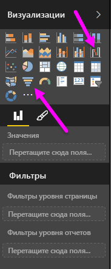
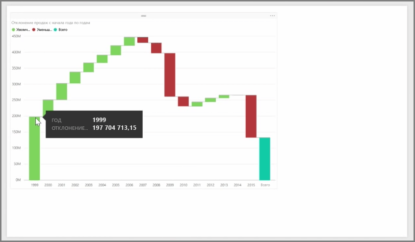
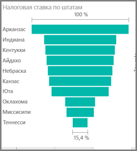

Каскадная и воронкообразная диаграммы являются двумя наиболее интересными (и, возможно, необычными) стандартными визуализациями, включенными в Power BI. Чтобы создать пустую диаграмму одного из этих типов, в области **Визуализации** выберите соответствующий значок.

**Каскадные диаграммы** обычно используются для отображения изменений в определенном значении за период времени.

Каскадные диаграммы имеют только два контейнера: *Категория* и *Ось Y*. Перетащите поле на основе времени, например *год*, в контейнер *Категория*, а значение, которое необходимо отслеживать, в контейнер *Ось Y*. Периоды времени, когда значение увеличивалось, по умолчанию отображаются зеленым цветом, а периоды уменьшения — красным.

**Воронкообразные диаграммы** обычно используются для отображения изменений в определенном процессе, например воронке продаж или удержании пользователей на веб-сайте.

Оба типа диаграмм — **каскадная** и **воронкообразная** — поддерживают срезы и визуальную настройку.

