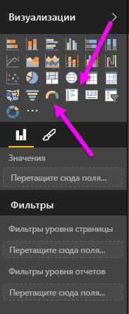
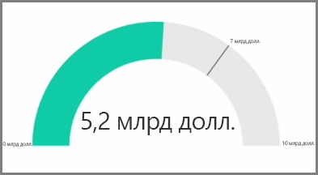
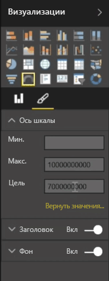
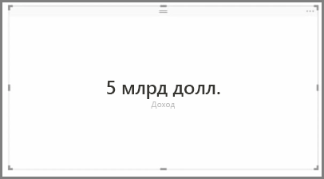
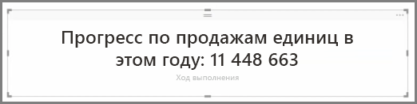

Как правило, визуализации используются для сравнения двух или более отличающихся значений. Тем не менее, иногда при составлении отчетов может потребоваться отследить только один ключевой показатель эффективности (KPI) или метрику в течение долгого времени. Для этого в Power BI Desktop есть **датчики** и визуальные элементы карточки **с одним числом**. Чтобы создать пустую диаграмму одного из этих типов, в области **Визуализации** выберите соответствующий значок.

Датчики особенно удобны при создании информационных панелей, на которых нужно отображать ход достижения конкретной цели. Чтобы создать датчик, щелкните его значок в области **Визуализации** и перетащите поле, которые необходимо отслеживать, в контейнер *Значение*.

По умолчанию датчики отображаются в масштабе 50 % или с двойным *значением*. Это можно настроить двумя способами. Чтобы динамически задавать значения, перетащите поля в контейнеры значений *Минимум*, *Максимум* и *Цель*. Кроме того, используйте параметры ручного форматирования визуального элемента, чтобы настроить диапазон датчика.

Визуализации карточек просто отображают числовое представление поля. По умолчанию в визуальных элементах карточек используются единицы измерения, чтобы сокращать числа, например, отображается "5 млрд" вместо "5 000 000 000". Используйте параметры форматирования визуального элемента, чтобы изменить единицы измерения или полностью отключить их.

Одно из интересных применений карточек — отображение пользовательской меры, которая дополнена текстом. Если воспользоваться предыдущим примером, с пользовательской мерой карточка могла бы содержать расширенные функции DAX и отображать что-то наподобие "Общий доход в этом году: 5 млрд" или "Ход выполнения в единицах продажи за год:" с числом, представляющим ход выполнения.

