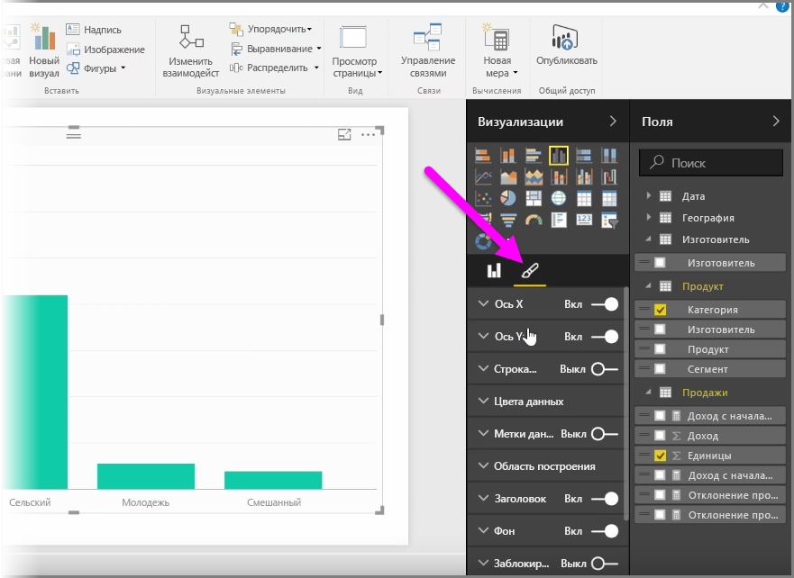
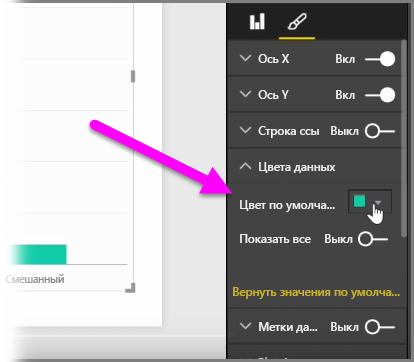
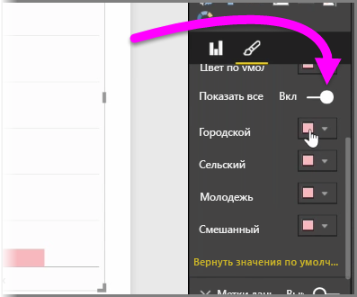
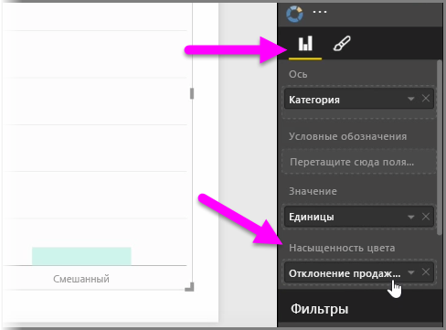
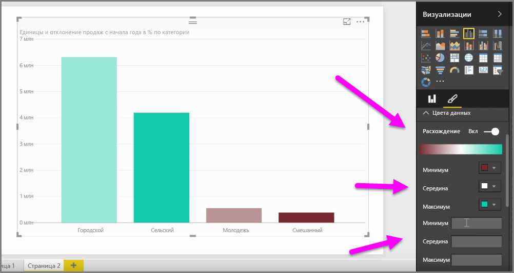
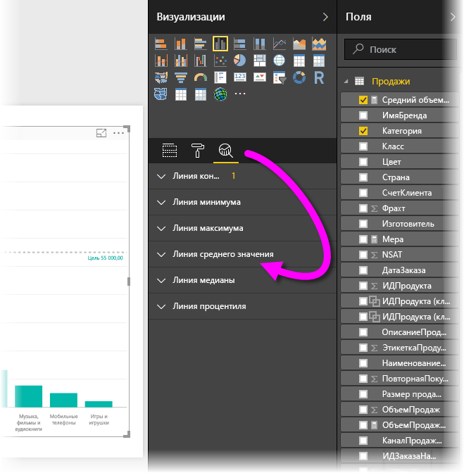

Бывает много случаев, когда может потребоваться изменить цвета, используемые на диаграммах или визуальных элементах. Power BI дает много возможностей для управления отображением цветов. Чтобы приступить к работе, выберите визуальный элемент в области **Визуализации** и щелкните значок **кисти**.

Существует множество возможностей для изменения цвета или форматирования визуального элемента. Можно изменить цвет всех линий визуального элемента, выбрав палитру рядом с элементом **Цвет по умолчанию**, а затем выбрав нужный цвет.

Можно также изменить цвет каждой линии (или другого элемента, в зависимости от типа выбранного визуального элемента), переключив ползунок **Показать все** в положение "Включено". После этого появятся палитры для каждого элемента.

Кроме того, можно изменить цвет на основе значения или меры. Для этого перетащите поле в контейнер **Насыщенность цвета** в области "Визуализации" (обратите внимание, что это возможно в **области полей**, а не в разделе **Кисть**).

Кроме того, можно изменить оттенки и цвета, используемые при заполнении цвета элементов данных. Можно также выбрать расходящиеся оттенки, переключив ползунок "Расхождение", чтобы отобразить три оттенка цвета. Помимо этого, можно задать значения *Минимум*, *В центре* и *Максимум*, отображаемые на диаграмме.

Эти значения также можно использовать для создания правил, например, чтобы задать один цвет для значений выше нуля и другой — для значений ниже нуля.

Еще один удобный инструмент для работы с цветами — *линия константы*, иногда она также называется *опорная линия*. Вы можете задать значение линии константы, указать ее цвет и даже добавить к ней метку. Чтобы создать линию константы (и другие интересные линии), выберите **область аналитики** (увеличительное стекло) и разверните раздел **опорной линии**.

Для визуализации в **области аналитики** можно создать множество других линий, таких как линии минимума, максимума, среднего значения, медианы и процентиля.

Наконец, вокруг отдельной визуализации можно создать границу и указать ее цвет, как и для других элементов управления.

