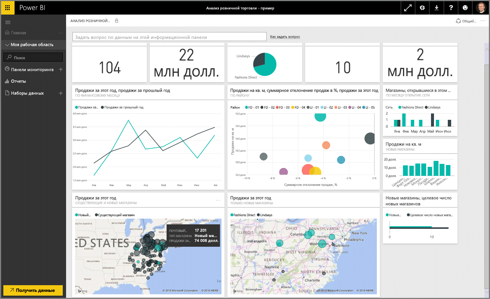
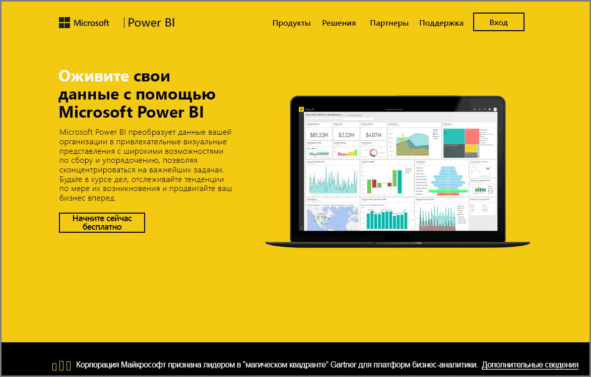

Добро пожаловать в раздел **Просмотр данных** курса **интерактивного обучения** для Power BI. Теперь, когда вы изучили Power BI Desktop и знаете, как получить и визуализировать данные, вы готовы к просмотру данных в службе Power BI.

Вы многое узнаете из этого раздела, но особенно выделяются привлекательная интерактивность и общий доступ в Power BI. Поэтому приготовьтесь к увлекательному и интересному уроку.

## Общие сведения о службе Power BI
*Узнайте, что может сделать служба Power BI для вашей организации.*

Служба Power BI является естественным продолжением **Power BI Desktop**, и ее возможности включают в себя передачу отчетов, создание информационных панелей и отображение вопросов о данных с использованием естественного языка. С помощью этой службы можно задать время обновления данных, предоставить общий доступ к данным организации и создать настраиваемые пакеты обновления.

В следующих подразделах мы рассмотрим службу Power BI и покажем, как она может превратить данные бизнес-аналитики в аналитические данные и среду для совместной работы и принятия решений.

