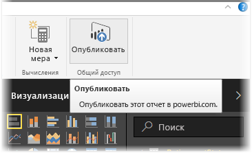
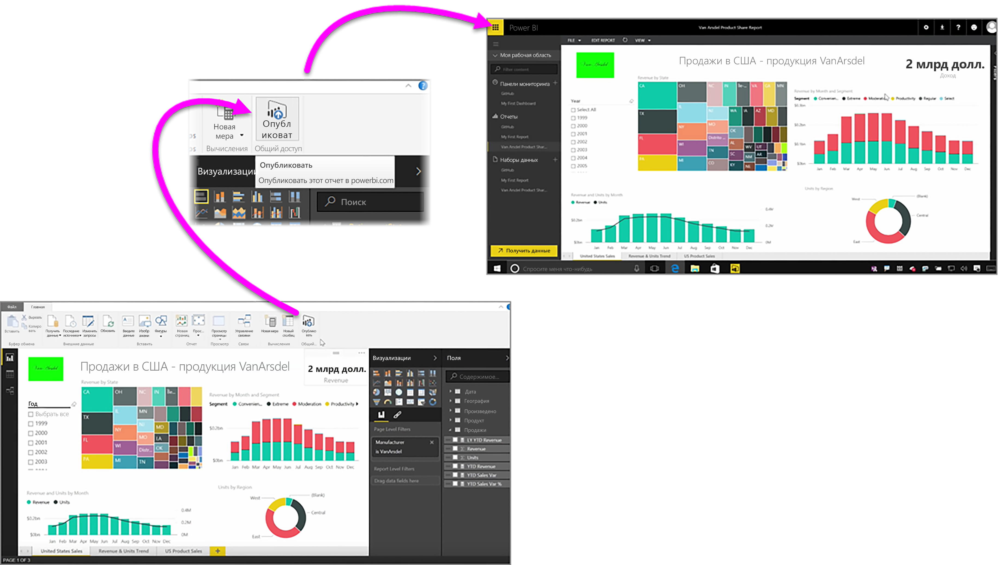

Публикация отчетов в службе Power BI осуществляется быстро и просто.

После того, как отчет создан в **Power BI Desktop**, просто нажмите кнопку **Опубликовать** на вкладке **Главная** в Power BI Desktop, и процесс начнется.

Отчет и данные, включая визуализации, запросы и пользовательские меры, помещаются в пакет и передаются в службу Power BI.

> [!NOTE]
> Обычно отчеты Power BI Desktop называют файлами **PBIX**. Это расширение присваивается им в Windows.
> 

По завершении передачи в диалоговом окне отобразится сообщение о том, что процесс публикации прошел успешно. Также в этом окне будет ссылка, которая ведет непосредственно к отчету в службе Power BI и открывается в веб-браузере.

Вот и все готово! Публиковать отчеты из Power BI Desktop в службе Power BI очень просто.

