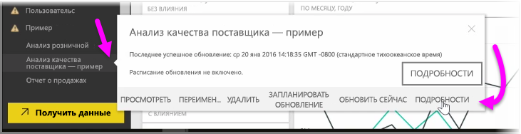
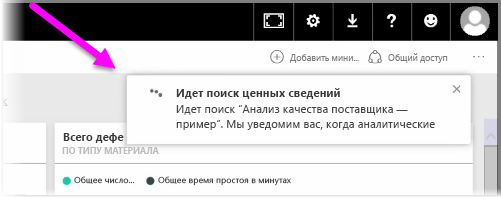
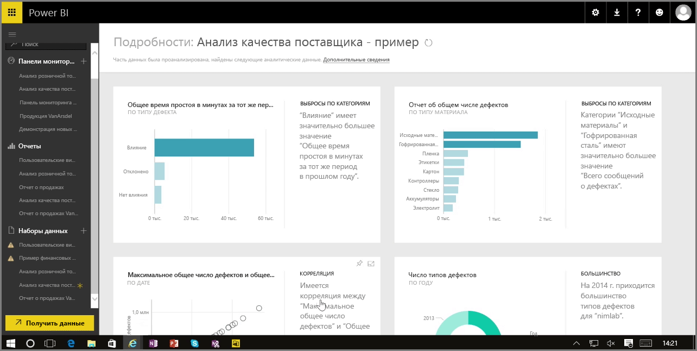

Работая с информационной панелью, отчетом или набором данных в службе Power BI, вы можете выполнить в Power BI поиск краткой аналитики данных. В Power BI в разделе **Наборы данных** в области слева выберите значок *многоточия* (три точки) рядом с необходимым набором данных. Отобразится меню параметров. **Краткая аналитика** — последний параметр справа.

При выборе этого параметра Power BI выполняет машинное обучение и поиск данных, анализируя их, чтобы получить краткую аналитику. В правом верхнем углу службы вы увидите уведомление о том, что Power BI выполняет поиск аналитики.

Приблизительно через 15 секунд вместо этого уведомления появится другое, указывающее, что в Power BI найдены некоторые аналитические данные.

Когда вы нажмете кнопку **Просмотреть аналитику** на уведомлении, отобразится страница визуальных элементов, которые показывают аналитики, найденные в Power BI (аналогично тому, что представлено на следующем изображении). Все отображенные аналитики можно просмотреть и проанализировать, прокручивая страницу вниз.

Как с любыми другими визуальными элементами, вы можете взаимодействовать с визуальными элементами на странице краткой аналитики. Кроме того, вы можете закрепить любой из них на имеющейся информационной панели или дополнительно отфильтровать один или несколько (или сколько нужно) элементов, чтобы выполнить поиск дополнительных аналитик, ожидающих своего времени.

Благодаря **краткой аналитике** Power BI может выявлять выбросы и тенденции в данных, а затем использовать эти результаты на информационных панелях или дополнительно уточнить и отфильтровать их, чтобы получить самые важные сведения.

