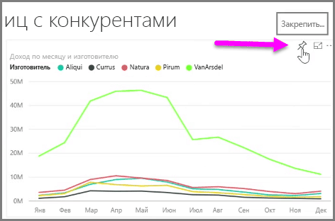
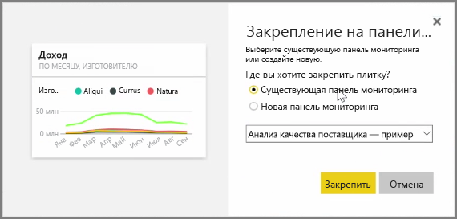
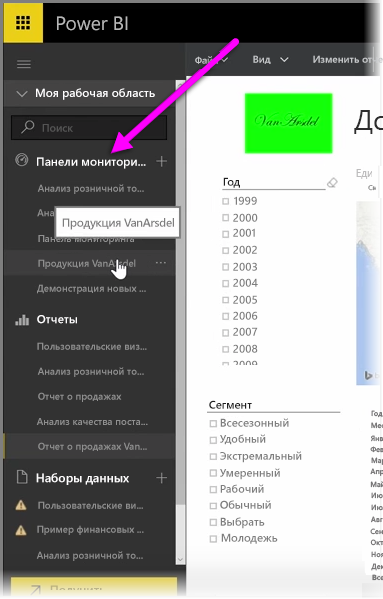
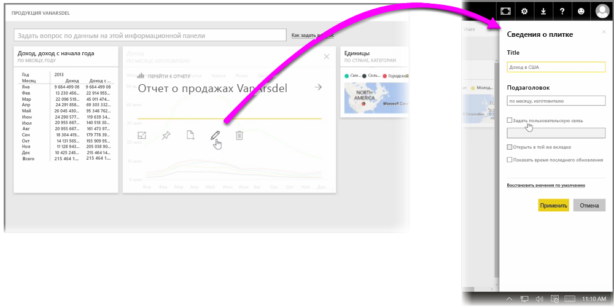

**Информационные панели** в Power BI — это одностраничные коллекции визуализаций, которые создаются внутри службы Power BI. Информационные панели создаются методом **закрепления** визуализаций из отчетов, созданных и опубликованных с помощью Power BI Desktop, или визуализаций, созданных внутри самой службы Power BI. **Закрепление** визуального элемента на информационной панели во многом похоже на закрепление рисунка на доске, висящей на стене — визуальный элемент фиксируется в определенной точке, чтобы другие его видели. Чтобы закрепить визуальный элемент, откройте отчет, содержащий этот элемент, в службе Power BI. Наведите указатель мыши на визуальный элемент, который требуется закрепить, и выберите значок **закрепления**.

Откроется диалоговое окно, в котором можно выбрать из раскрывающегося меню целевую информационную панель для данного визуального элемента или создать новую информационную панель. Также можно предварительно посмотреть, как закрепленный визуальный элемент будет выглядеть на информационной панели. На одной панели можно закреплять визуализации из разных отчетов и страниц, что позволяет объединить различные наборы данных и источники на одной странице аналитики.

На **информационные панели** можно добавлять визуализации любого типа, включая диаграммы, карты, изображения и фигуры, просто "закрепив" их на панели. Когда визуальный элемент закреплен на информационной панели, его называют **плиткой**.

Все информационные панели, включая новые, отображается в разделе информационных панелей с левой стороны службы Power BI. Чтобы просмотреть информационную панель, выберите ее из списка.

Если хотите, можете изменить расположение визуальных элементов на информационной панели. Чтобы изменить размер плитки, перетащите ее маркеры до необходимого размера. Чтобы переместить плитку, просто щелкните и перетащите ее в другое место на информационной панели. Наведите указатель мыши на плитку и нажмите значок с изображением **карандаша**, чтобы открыть **Сведения о плитке**, где можно изменить **Заголовок** или **Подзаголовок**.

Щелкните плитку информационной панели, чтобы просмотреть отчет, из которого она была взята. Это позволяет быстро просмотреть базовые данные, использованные для создания визуального элемента. Также можно изменить эту ссылку, используя поле **Задать пользовательскую связь** в области **Сведения о плитке**.

Плитки из одной информационной панели можно закреплять на другой, например, если имеется коллекция панелей и необходимо создать одну сводную информационную панель. Процесс аналогичен: наведите указатель мыши на плитку и выберите **значок закрепления**. Информационные панели просто создавать и изменять. А также их можно настраивать, чтобы одностраничная информационная панель отображала именно то, что вам необходимо.

