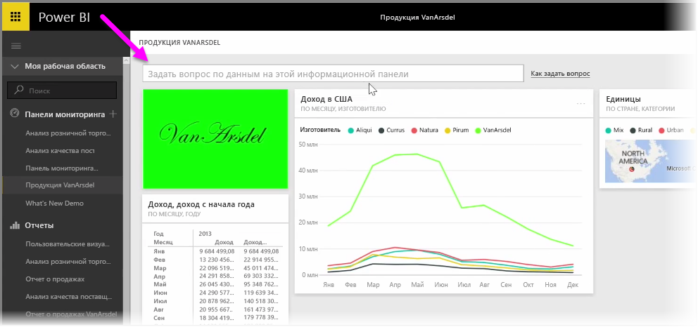
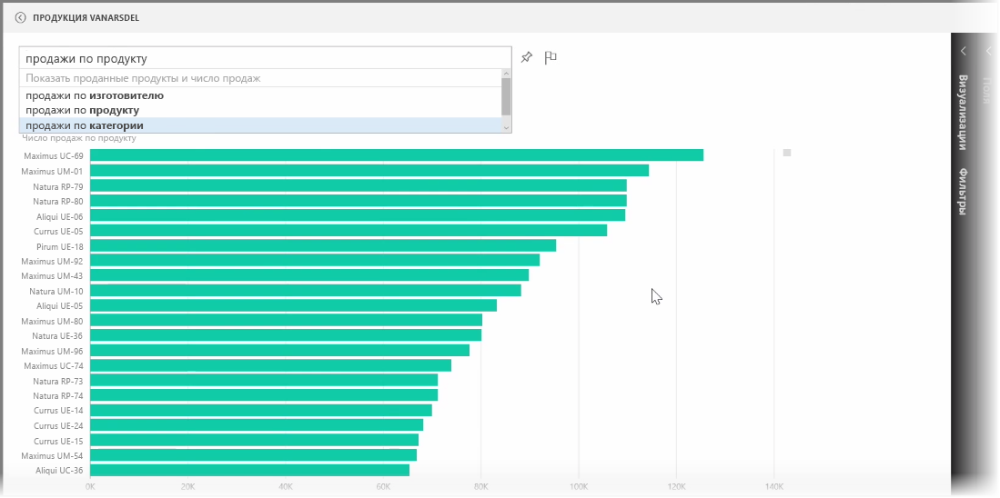
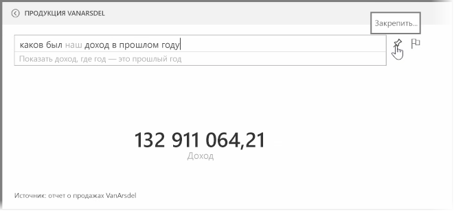
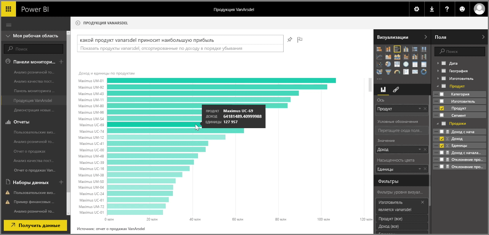

Power BI включает в себя мощный модуль распознавания языка, который позволяет задавать вопросы о данных, используя естественные разговорные фразы. Таким образом, создавая отчеты и визуализации с помощью Power BI, вы также можете создать диаграммы и графики, используя простые вопросы.

Чтобы задать вопрос о данных, в Power BI откройте информационную панель, и в верхней части экрана появится поле ввода, где можно задать вопросы об отображаемых данных. Эту функцию иногда называют *Вопросы и ответы* или просто **Q&A**.

Если щелкнуть это поле, Power BI отобразит несколько предлагаемых терминов на основе введенных вами данных, например "Доход с начала года". Можно щелкнуть предлагаемый термин, чтобы просмотреть результат, который обычно отображается в виде простой таблицы или карточки. При выборе одной из предлагаемых фраз Power BI автоматически создает визуальный элемент на основе выбора в режиме реального времени.

Также можно задать вопрос, используя естественный язык, например так: "Каким был наш доход за прошлый год?" Или так: "Какой продукт лучше всего продавался в марте 2014 года?" Power BI отображает интерпретацию вопроса и выбирает наиболее подходящий тип визуального элемента для представления ответа. Его можно **закрепить** на любой информационной панели, выбрав значок **закрепления**, аналогично другим визуальным элементам в Power BI.

Вы можете изменить визуальный элемент, созданный с помощью естественного вопроса или фразы, в любой момент этого процесса. Просто используйте области **Визуализации** и **Поля** в правой части экрана. Как и для всех других визуальных элементов в Power BI, можно изменять расположение, настраивать фильтры и изменять входные данные полей.

Когда визуальный элемент полностью готов, для сохранения визуализации на информационной панели просто щелкните значок **закрепления** рядом с полем ввода вопроса.

