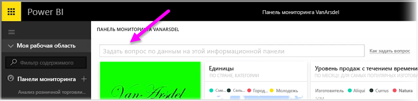
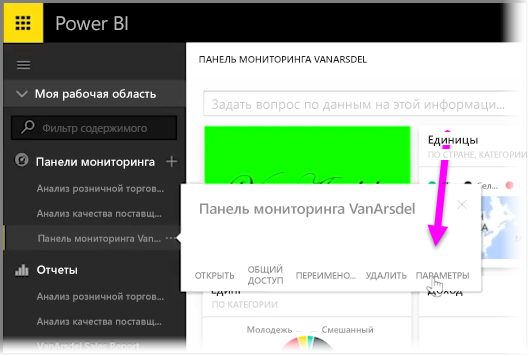
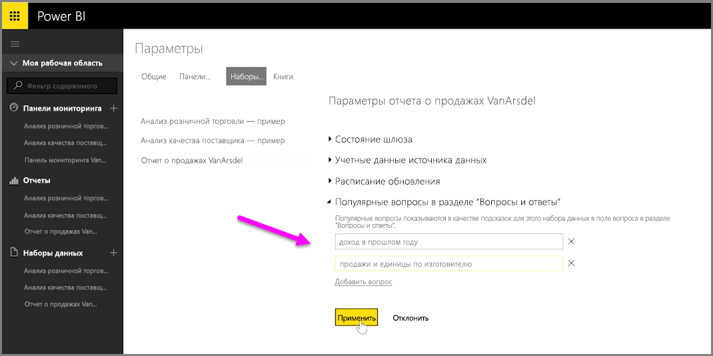

С помощью Power BI можно добавить собственные вопросы, предлагаемые другим пользователям, использующим поле естественного языка запросов для информационной панели, которое часто называют полем **Вопросы и ответы**. Пользователи будут видеть эти предлагаемые вопросы при щелчке поля ввода в верхней части информационной панели.

Чтобы добавить собственные вопросы, щелкните многоточие (три точки "…") рядом с именем информационной панели, которую вы хотите использовать, и выберите в меню пункт **Параметры**.

 Откроется страница **Параметры** для информационной панели и базовых наборов данных или книг. Вы можете полностью отключить поисковое поле ввода вопросов и ответов в разделе **Информационные панели** на странице **Параметры**, но нам нужно добавить вопросы, поэтому мы выбираем раздел **Наборы данных**.

В разделе **Наборы данных** отображаются все наборы данных, связанные с информационной панелью. Выберите из списка набор данных, связанный с информационной панелью, выберите **Featured Q&A Questions** (Избранные вопросы), а затем щелкните ссылку **Добавить вопрос**. Введите вопрос или запрос в поле ввода и щелкните **Применить**.

Теперь при каждом щелчке поискового поля ввода на выбранной информационной панели будут отображаться предлагаемые вами варианты в верхней части списка запросов. И щелкнув один из вопросов, пользователь сразу же получит соответствующий ответ. Это удобный способ сделать так, чтобы пользователи информационной панели думали о типе доступных данных и том, как их лучше всего использовать.

