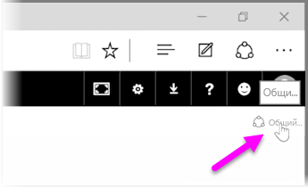
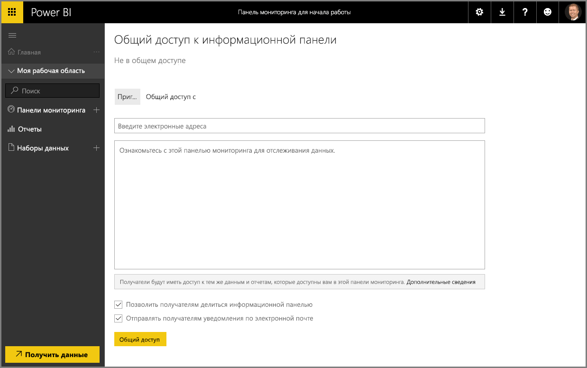

Мы уже изучили, как Power BI помогает находить данные, собирать их в модели и создавать отчеты и визуализации на основе этих данных. Также мы знаем, как публиковать эти отчеты в службе Power BI и создавать информационные панели, которые помогают отслеживать информацию за определенный период. Все эти функции становятся еще эффективнее, если предоставить общий доступ к собранным сведениям для других пользователей в организации. К счастью, предоставлять общий доступ к информационным панелям очень легко.

Чтобы предоставить общий доступ к информационной панели, откройте ее в службе Power BI и выберите ссылку **Поделиться** в правом верхнем углу.

Откроется страница **Общий доступ к информационной панели**, где можно выбрать раздел **Пригласить**, а затем в поле ввода **Адрес электронной почты** ввести пользователей, которым вы хотите предоставить доступ к информационной панели. По мере ввода Power BI сверяет адреса электронной почты с учетными записями в вашем домене и домене Office 365 и, по возможности, выполняет автозаполнение. Также можно копировать и вставлять адреса электронной почты в это поле, использовать список рассылки, группу безопасности или группу Office 365, чтобы одновременно ввести несколько пользователей.

Если установлен флажок (в нижней части) *Отправлять получателям уведомления по электронной почте*, то получатели получат сообщение о том, что вы открыли для них доступ к информационной панели и ссылку на саму информационную панель. В сообщение электронной почты, которое они получат, можно добавить свое примечание, или отправлять примечание, которое уже создано в Power BI (оно находится в поле непосредственно под адресом электронной почты).

>[!NOTE]
>Получатели, не имеющие учетной записи Power BI, должны будут пройти процесс регистрации, прежде чем смогут просмотреть вашу информационную панель.
> 
> 

Любой пользователь, которому вы открыли доступ к информационной панели, сможет видеть ее и взаимодействовать с ней точно так же, как вы. Тем не менее, к базовым отчетам у них будет доступ *только для чтения*, а к базовым наборам данных *доступа не будет*.

На странице "Общий доступ к информационной панели" также можно выбрать вкладку **Предоставлен общий доступ**, чтобы просмотреть список пользователей, которым уже открыт доступ к этой информационной панели.

