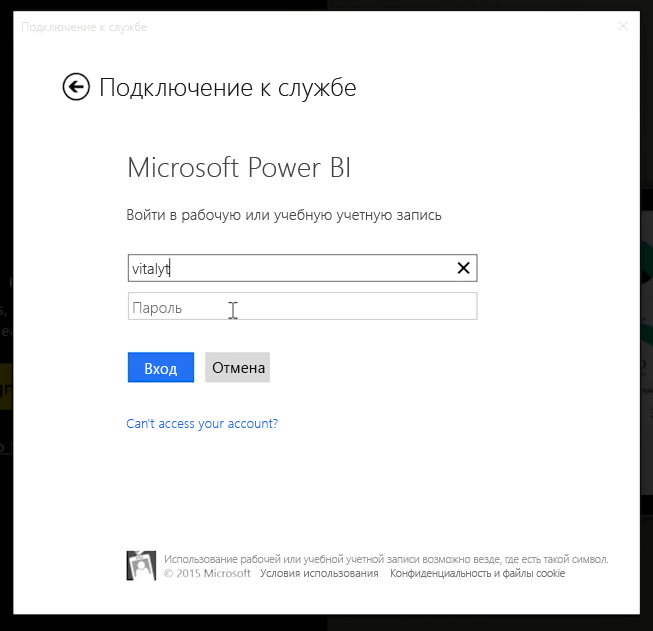
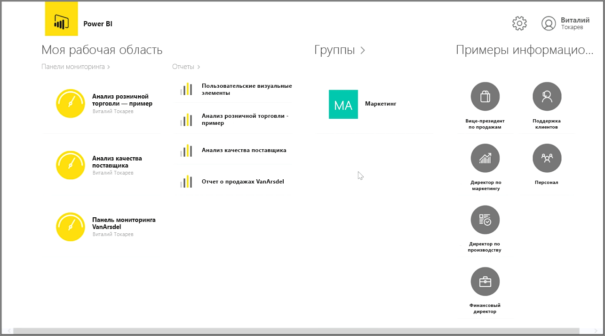
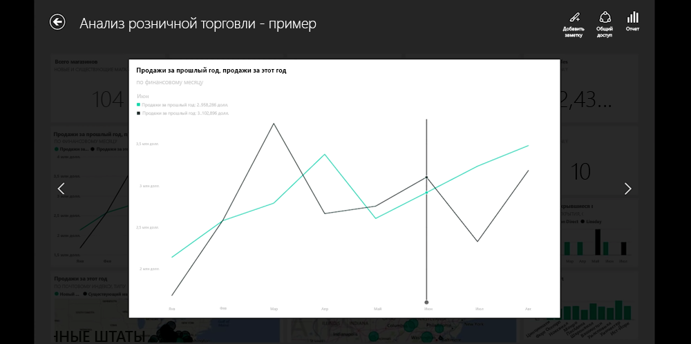
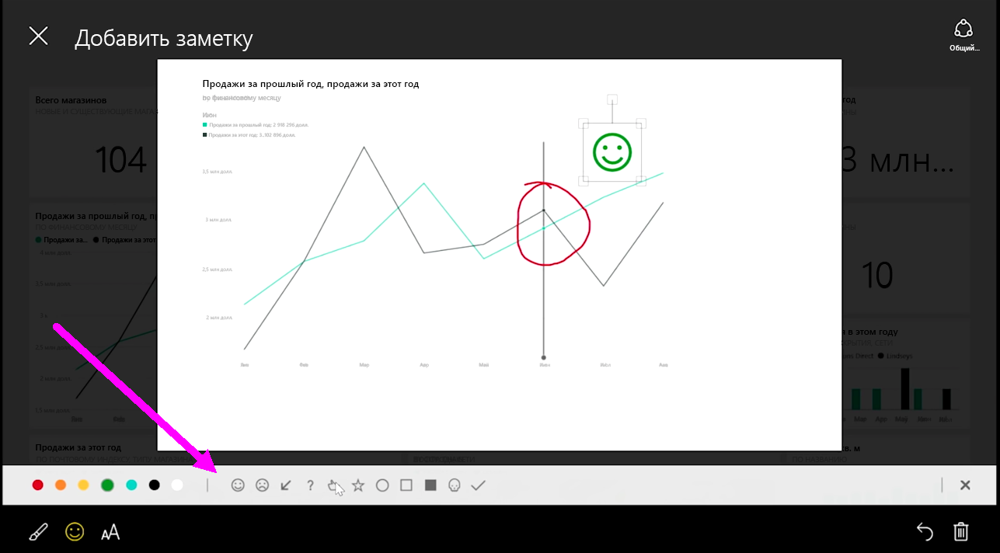

Если требуется отслеживать данные, находясь в поездке, можно использовать одно из мобильных приложений Power BI для устройств с операционными системами iOS, Android или Windows.

При использовании приложения Power BI сначала войдите в свою учетную запись, используя учетные данные службы Power BI. На мобильном устройстве Windows (в данном случае — планшете) процедура входа выглядит следующим образом.

На первом экране отображается все содержимое, к которому у вас есть доступ, включая отчеты, информационные панели и группы. Также есть примеры информационных панелей, которые можно использовать или просто просмотреть, чтобы ознакомиться с возможностями Power BI. Приложение разработано таким образом, чтобы поддерживать возможности сенсорного управления: коснитесь информационной панели или отчета, чтобы просмотреть их в полноэкранном режиме, или используйте палец для прокрутки между ними.

Можно открыть любую информационную панель, коснувшись ее пальцем. На информационной панели можно коснуться любой плитки, чтобы сфокусироваться на ней и просмотреть в увеличенном виде.

Также можно добавить примечание с какими-либо полезными сведениями, коснувшись в правом верхнем углу кнопки **Примечание**. Эта функция позволяет рисовать на увеличенной плитке, чтобы выделить определенные области интересов. Инструменты для создания примечания находятся в нижней части экрана.

Откройте общий доступ к плитке с примечанием, коснувшись ссылки **Поделиться** в правом верхнем углу.

Чтобы просмотреть базовый отчет к этой плитке, коснитесь ссылки **Отчет** в правом верхнем углу. При этом отобразятся точно такие же визуализации, как и в веб-браузере или в Power BI Desktop. А также будут доступны возможности взаимодействия с отчетом — можно касаться панелей, детализировать данные или использовать срезы.

