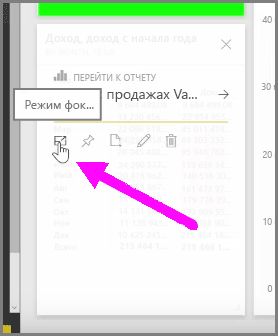
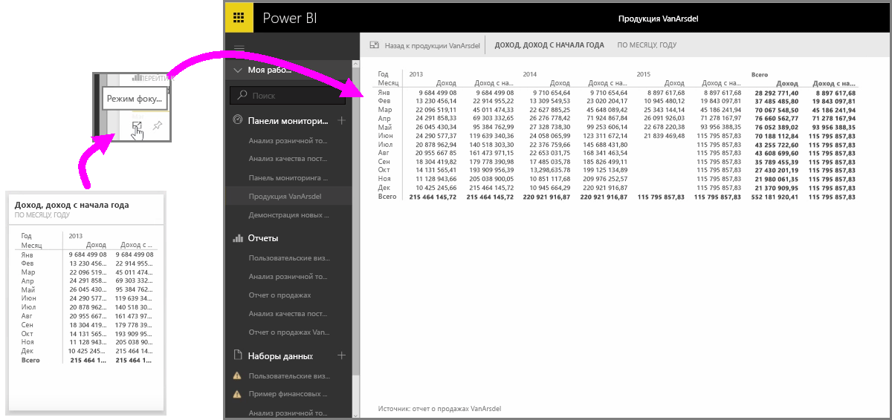

При просмотре в информационных панелей или отчетов Power BI в службе иногда бывает удобно сосредоточиться на отдельной диаграмме или визуализации. Это можно сделать двумя разными способами.

В информационной панели наведите указатель мыши на плитку, чтобы отобразить несколько значков в правом верхнем углу. Если выбрать многоточие (три точки), то можно отобразить набор значков, которые представляют действия, доступные для плитки.

Значок слева называется **Режим фокусировки**. Щелкните этот значок, чтобы развернуть плитку на всю информационную панель.

**Режим фокусировки** позволяет намного детальнее изучать визуальные элементы и условных обозначений. Например, при изменении размера плитки в Power BI некоторые столбцы могут не отображаться, так как им не хватило места на плитке.

В **режиме фокусировки** вы увидите все данные. Можно также закрепить визуальный элемент непосредственно из режима фокусировки на другой информационной панели, щелкнув значок **Закрепить**. Для выхода из **режима фокусировки** щелкните значок **Назад** в левом верхнем углу области **Режим фокусировки**.

Аналогично можно просмотреть отчет. Наведите указатель мыши на визуальный элемент, чтобы отобразить три значка в правом верхнем углу, и щелкните значок **Режим фокусировки**. Визуализация расширится на весь холст отчета. Визуальный элемент остается интерактивным в этом режиме, хотя перекрестная фильтрация между визуализациями временно утрачивается.

Наведите указатель мыши на развернутую плитку или отчет и щелкните значок **Назад** слева от указателя в верхнем левом углу, чтобы вернуться к предыдущему представлению.

