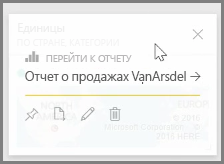
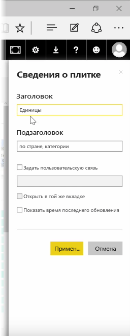
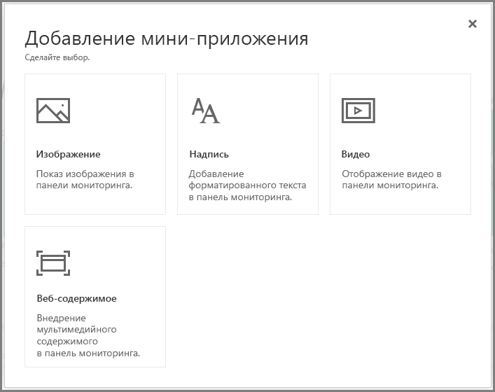
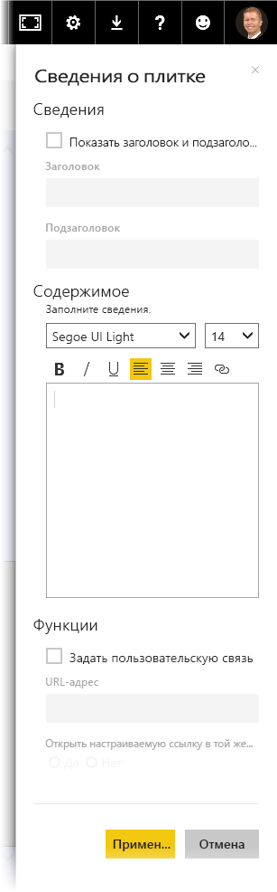

После создания информационной панели вы можете изменить ее *плитки* в службе Power BI, чтобы изменить форматирование.

Чтобы внести изменения в плитку, наведите на нее указатель мыши и выберите многоточие (три точки), чтобы отобразить набор значков, которые позволяют изменить плитку.

Выберите значок **пера**, чтобы открыть область **Сведения о плитке**. Здесь можно изменить **заголовок** и **подзаголовок** плитки, включая дату и время ее последнего обновления, а также и другие сведения, например, можно создать пользовательскую связь.

По умолчанию при щелчке плитки информационной панели отображается отчет, на котором она была основана. Чтобы изменить это поведение, используйте поле **Задать пользовательскую связь** в области **Сведения о плитке**. Часто эта функция применяется, чтобы перенаправлять пользователей на домашнюю страницу организации при щелчке изображения логотипа.

## Добавление мини-приложений на информационную панель
На информационную панель можно также добавить мини-приложения. **Мини-приложение** — это специальная плитка информационной панели, которая вместо визуализации содержит другие элементы, такие как изображения, видео из Интернета, текстовое поле или форматированное веб-содержимое.

Если щелкнуть ссылку "Добавить мини-приложение" в правом верхнем углу информационной панели, откроется диалоговое окно **Добавить мини-приложение**.

Например, если добавить текстовое поле, то справа появится область **Сведения о плитке**, где можно изменить данные точно так же, как для любой другой плитки. Но для мини-приложений также имеется раздел, позволяющий определить или изменить содержимое мини-приложения, например редактор форматированного текста для текстового поля.

Благодаря мини-приложениям и возможности изменить данные плитки можно настроить информационную панель и оформить ее должны образом.

