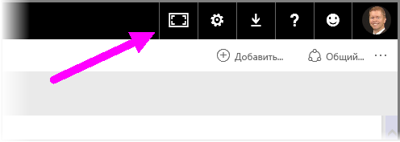
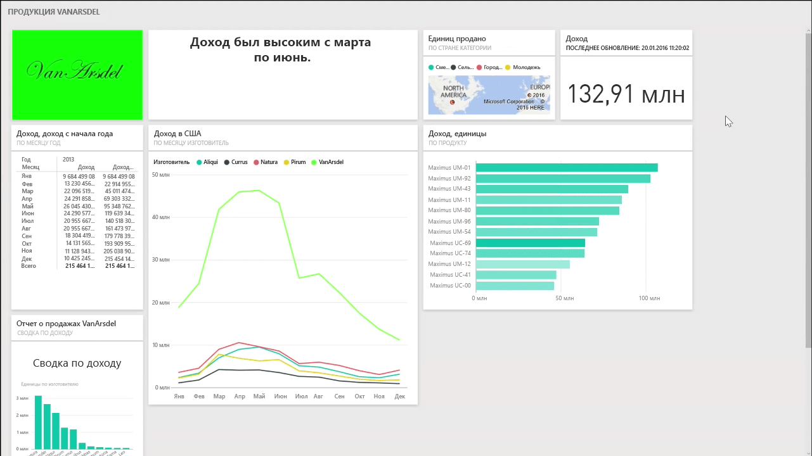
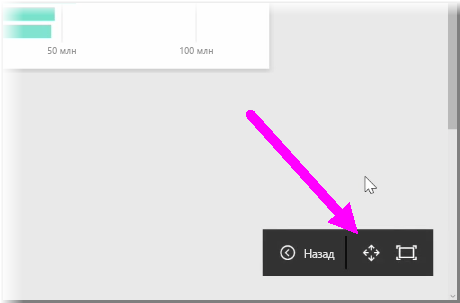
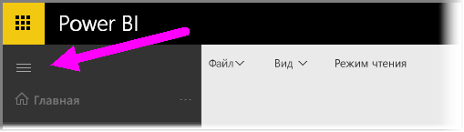

Иногда при создании информационных панелей оказывается, что у вас больше содержимого, чем может поместиться на холсте. Существует несколько решений, которые помогут вам управлять отображаемым пространством информационной панели, чтобы все содержимое панели было удобно просматривать.

Самым простым способом отображения всей информационной панели на одном экране является **Полноэкранный режим**, который включается кнопкой в правом верхнем углу информационной панели.

Нажатие кнопки **Полноэкранный режим** переводит браузер в полноэкранный режим, удаляя все элементы хрома вокруг информационной панели и тем самым увеличивая пространство для просмотра.

Пребывая в **полноэкранном режиме** можно выбрать параметр **По размеру экрана**, чтобы сжать все плитки по размеру одного экрана и не использовать полосы прокрутки. Эту функцию обычно называют *ТВ-режимом*, и она полезна при демонстрации презентаций с использованием информационных панелей или при показе информационной панели на больших мониторах.

Другой способ управления пространством информационной панели — свернуть область навигации в левой части страницы, щелкнув значок "гамбургер". Чтобы развернуть панель навигации, щелкните этот значок снова.

Чтобы на информационной панели область навигации всегда была гарантированно свернута, добавьте следующий текст в конец URL-адреса:

> ?collapseNavigation=true
> 
> 

Для пользователей, которые перейдут по этой ссылке, информационная панель откроется со свернутой областью навигации.

