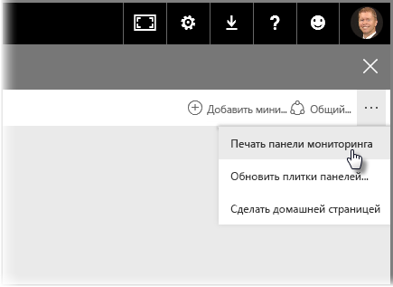
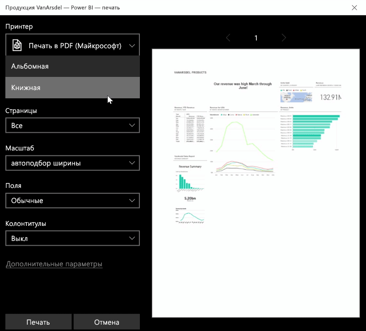
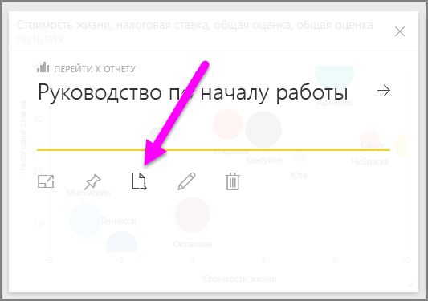
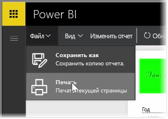

Иногда необходимо распечатать отчет или информационную панель, чтобы принести на собрание или передать кому-либо. В Power BI существует несколько способов печати визуальных элементов.

В службе Power BI щелкните многоточие (три точки) в правой верхней части службы и выберите **Печать панели мониторинга**.

Появится диалоговое окно **Печать**, в котором можно выбрать принтер, на который следует отправить информационную панель, а также стандартные параметры печати, например *книжную* или *альбомную* ориентацию.

## Экспорт данных из визуального элемента
Вы можете экспортировать данные из любого визуального элемента в службе Power BI. Просто щелкните многоточие в любом визуальном элементе, а затем нажмите кнопку **Экспортировать данные** (расположена посередине). После этого будет создан CSV-файл, который будет скачан на ваш локальный компьютер, и в браузере появится сообщение о завершении скачивания (как для любого скачивания в браузере).

Можно также распечатать или экспортировать данные непосредственно из отчета. При просмотре отчета в службе Power BI выберите **Файл > Печать**, чтобы открыть диалоговое окно печати.

Как и в случае информационной панели, можно также экспортировать данные из визуального элемента в отчете, нажав кнопку "Экспортировать" в визуальном элементе.

