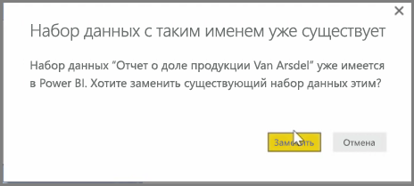
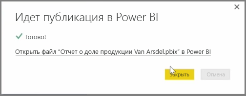

Отчеты и наборы данных из Power BI Desktop, которые уже были опубликованы в службе Power BI, можно обновить. Для этого нажмите кнопку **Опубликовать** на вкладке **Главная** ленты.

При публикации отчета, который уже существует в службе Power BI, будет предложено подтвердить замену предыдущего набора данных и отчетов измененной версией, которая была только что выбрана для обновления.

Если нажать кнопку **Заменить**, наборы данных и отчеты в службе Power BI будут заменены на наборы данных и отчеты в последней версии файла Power BI Desktop.

Как и в любом другом процессе **публикации** из Power BI Desktop, диалоговое окно проинформирует о том, что публикация прошла успешно, и отобразится ссылка на этот отчет в службе Power BI.

Это способ обновления данных вручную. Наборы данных и отчеты также можно обновлять автоматически; этот процесс описан в другом разделе обучения.

