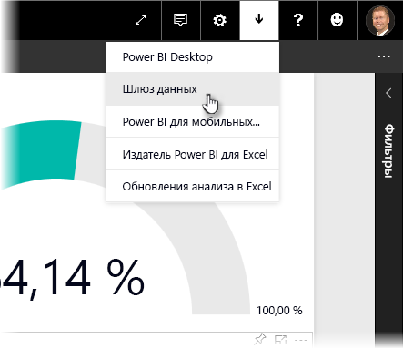
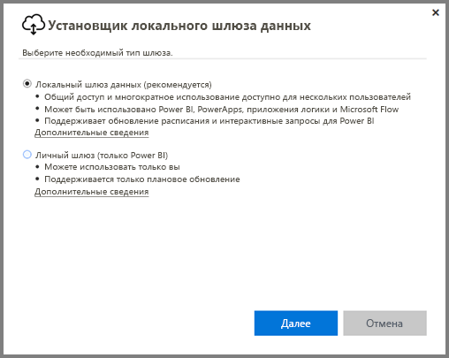
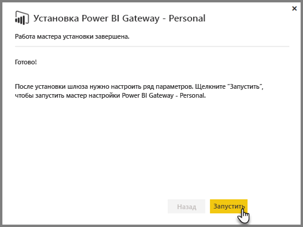
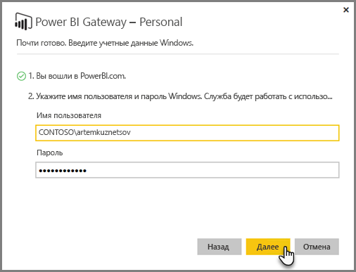
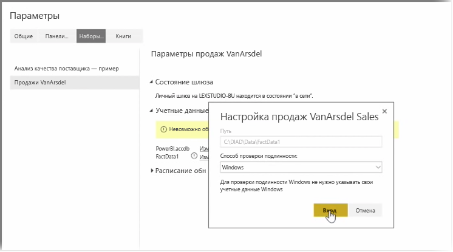
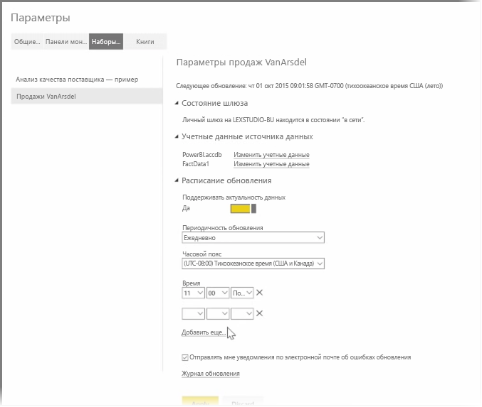

В предыдущих разделах мы рассмотрели, как использовать Power BI для подключения к источникам данных и как вручную обновлять наборы данных в службе Power BI. Однако скорее всего вы не захотите выполнять обновление вручную каждый раз, когда изменяются данные, поэтому с помощью Power BI можно настроить запланированное обновление, которое позволит автоматически подключаться к источникам данных и публиковать их в службе Power BI. Это также позволит подключать службу к любым локальным источникам данных, включая файлы Excel, базы данных Access, базы данных SQL и др.

Система, которая позволяет подключать локальные источники данных к службе Power BI, называется **шлюзом данных**. Это небольшое приложение, которое запускается на компьютере и использует готовое расписание для подключения к данным, сбора всех обновлений и отправки их в службу Power BI. **Личный шлюз** — это версия **шлюза данных**, которую можно использовать без настройки администратором.

>[!NOTE]
>Компьютер, на котором запущен личный шлюз Power BI, *должен* быть подключен к Интернету, чтобы **личный шлюз** работал правильно.
> 

Чтобы настроить свой **личный шлюз**, сначала войдите в службу Power BI. Выберите значок **скачивания** в правом верхнем углу экрана, а затем в меню выберите **Шлюзы данных**.

Далее вы будете перенаправлены на веб-страницу, где можно выбрать **Power BI Gateway - Personal**, как показано ниже.

После того, как завершится скачивание, запустите приложение и выполните шаги мастера установки.

Вам будет предложено запустить мастер настройки, чтобы настроить шлюз.

Сначала вам будет предложено войти в свою учетную запись службы Power BI, а затем — в учетную запись Windows компьютера, так как служба шлюза работает под вашей учетной записью.

Вернитесь к службе Power BI. Нажмите кнопку "…" (многоточие) рядом с набором данных, который необходимо обновить, и в открывшемся меню выберите **Запланировать обновление**. Откроется страница **Параметры обновления**. Power BI определит, что вы установили **личный шлюз**, и сообщит его состояние.

Выберите **Изменить учетные данные** рядом с каждым применимым источником данных и настройте проверку подлинности.

Наконец, задайте параметры в разделе **Расписание обновлений**, чтобы активировать автоматические обновления и настроить время и частоту их выполнения.

Вот и все! В запланированное время Power BI свяжется с этими источниками данных, используя предоставленные вами учетные данные и подключение к компьютеру с запущенным **личным шлюзом**, и выполнит обновление отчетов и наборов данных в соответствии с расписанием. При следующем входе в Power BI эти информационные панели, отчеты и наборы данных будут отражать данные на момент последнего запланированного обновления.

## Дальнейшие действия
**Поздравляем!** Вы завершили раздел **Просмотр данных** курса **интерактивного обучения** для Power BI. Служба Power BI содержит множество интересных способов просмотра данных, совместного использования ценных сведений и взаимодействия с визуальными элементами. И все эти возможности доступны через браузер, из службы, к которой можно подключиться, где бы вы не находились.

Одним из мощных и хорошо известных партнеров Power BI является **Excel**. Power BI и Excel прекрасно работают вместе; книги Excel будут себя отлично чувствовать в Power BI, и их просто туда перенести.

Насколько просто? Следующий раздел **Power BI и Excel** посвящен именно этому вопросу.

До встречи в следующем разделе!

