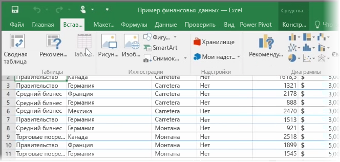
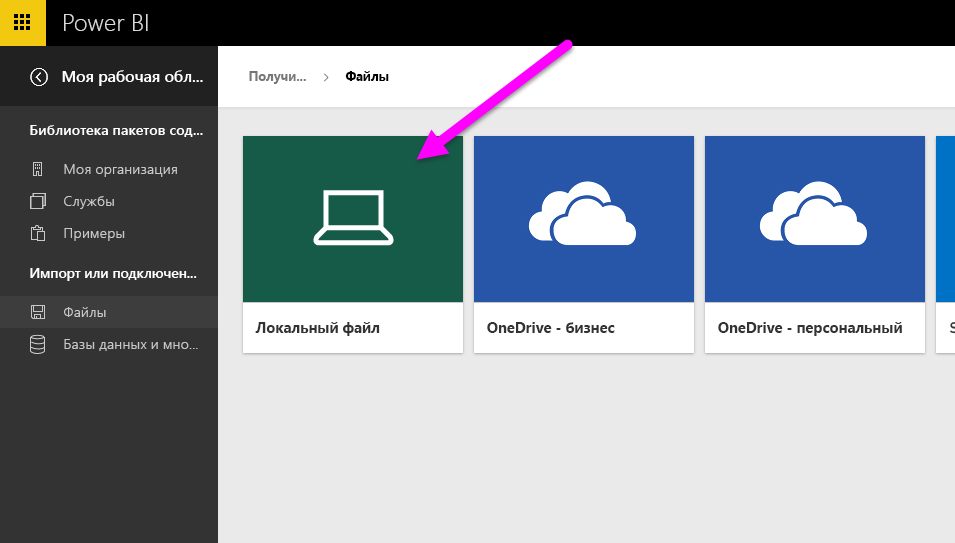
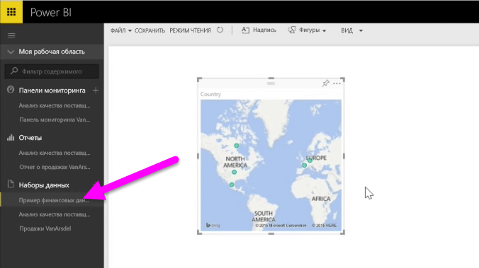

В этом разделе сначала рассматривается, как импортировать в Power BI файл книги Excel, содержащей простую **таблицу**, с локального диска. Затем вы узнаете, как начать изучение этой таблицы данных в Power BI, создав отчет.

## Форматирование данных в виде таблицы обязательно
Чтобы обеспечить импорт данных из книги в Power BI, они должны быть **отформатированы в виде таблицы**. Это просто. В Excel можно выделить диапазон ячеек, а затем на вкладке **Вставка** ленты Excel щелкнуть **Таблицы**.

У всех столбцов должны быть понятные имена. Это упростит поиск нужных данных при создании отчетов в Power BI.

## Импорт с локального диска
Где бы ни хранились файлы, Power BI позволяет легко импортировать их. В Power BI можно выбрать **Получить данные** > **Файлы** > **Локальный файл**, чтобы найти и выбрать нужный файл Excel.

После импорта данных в Power BI можно приступать к созданию отчетов.

Разумеется, файлы не обязательно должны храниться на локальном диске. Если файлы хранятся в OneDrive или на сайте SharePoint группы, то так даже лучше. Мы рассмотрим это более подробно в одном из следующих разделов.

## Начало создания отчетов
После импорта данных книги в Power BI создается набор данных. Он отображается в разделе **Наборы данных**. Теперь можно приступить к изучению данных, создавая отчеты и информационные панели. Просто щелкните значок **Меню "Открыть"**  рядом с полем набора данных и щелкните **Исследовать**. Появится новый пустой холст отчета. Справа в разделе **Поля** вы увидите таблицы и столбцы. Просто выберите поля, чтобы создать новую визуализацию на холсте.

В разделе **Визуализации** можно изменить тип визуализации, а также применить **фильтры** и другие свойства.

