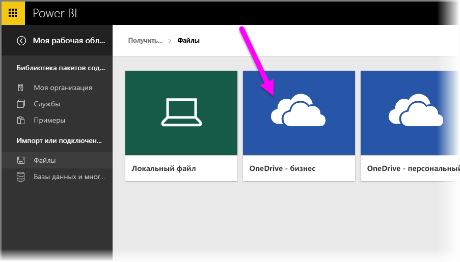
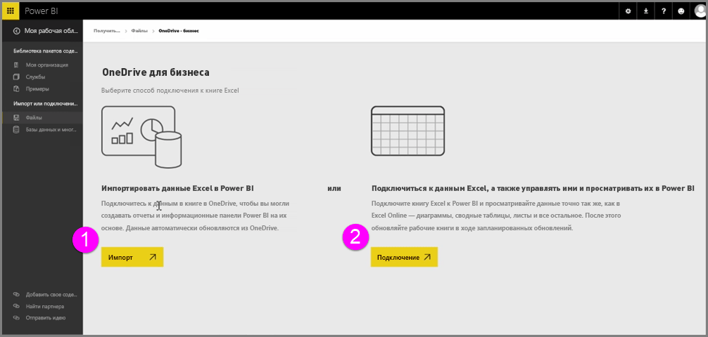
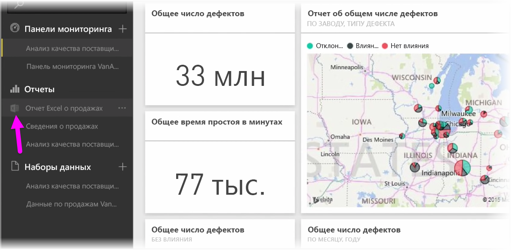

Обеспечьте полную интеграцию Power BI и Excel при сохранении книги Excel в OneDrive.

Так как OneDrive находится в облаке, как и Power BI, между Power BI и OneDrive устанавливается активное подключение. Если внести изменения в книгу в OneDrive, они будут *автоматически синхронизированы* с Power BI. Ваши визуализации в отчетах и информационных панелях постоянно обновляются. Если книга подключается к внешним источникам данных, например, к базе данных или веб-каналу OData, то вы можете использовать функции **расписания обновлений** Power BI, чтобы проверять наличие обновлений. Необходимо задать вопросы о данных в книге? Это не проблема. Именно для этого можно использовать функции **вопросов и ответов** Power BI.

Существует два способа подключения к файлам Excel в OneDrive для бизнеса.

1. Импорт данных Excel в Power BI
2. Подключиться к данным Excel, а также управлять ими и просматривать их в Power BI

### Импорт данных Excel в Power BI
При импорте данных Excel в Power BI данные таблиц из книги загружаются в новый набор данных в Power BI. Если в книге есть листы **Power View**, они также импортируются, а в Power BI автоматически создаются новые отчеты.

Power BI сохранит подключение к файлу книги в OneDrive для бизнеса. Если внести изменения в книгу, то при сохранении эти изменения будут *автоматически синхронизированы** с Power BI. Обычно это происходит в течение часа. Если книга подключается к внешним источникам данных, вы можете настроить запланированное обновление, чтобы набор данных в Power BI оставался актуальным. Так как визуализации в отчетах и информационной панели в Power BI будут использовать данные из набора данных, то при их просмотре запросы будут выполняться очень быстро.

### Подключение к данным Excel, а также управление ими и просмотр их в Power BI
Если вы установите подключение к книге Excel, то обеспечите удобство работы с книгой в Excel и Power BI. При таком подключении рядом с отчетом книги отображается небольшой значок Excel.

В отчете книга Excel в Power BI отображается точно так же, как и в **Excel Online**. Можно просматривать и редактировать листы в Excel Online с помощью пункта "Изменить" в меню, открывающемся при щелчке многоточия. При внесении изменений все визуализации, закрепленные на информационной панели, обновляются автоматически.

В Power BI не создается набор данных. Все данные остаются в книге в OneDrive. Одним из многих преимуществ такого подхода является то, что вы можете настроить **запланированное обновление**, если книга подключается к внешним источникам данных. Можно выбрать элементы, например сводные таблицы и диаграммы, и **закрепить** их непосредственно на информационных панелях в Power BI. Любые внесенные изменения автоматически отображаются в Power BI. И вы можете использовать удивительные функции **вопросов и ответов** Power BI, чтобы задавать вопросы о данных в книге.  

