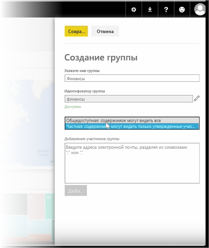
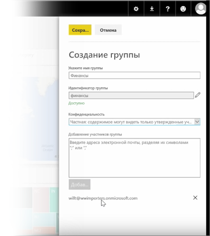

Этот урок мы начнем с создания *группы*. **Группа** определяет набор пользователей, имеющих доступ к конкретным информационным панелям, отчетам и данным.

Группы в Power BI основаны на группах в Office 365, поэтому, если вы уже использовали группы Office 365 для управления электронной почтой, календарем и документами группы, то вы увидите, что в Power BI доступны аналогичные функции, а также многое другое. При создании группы в Power BI фактически создается группа Office 365.

В этом модуле используется сценарий настройки новой финансовой группы. Мы покажем, как настроить группу, совместно использовать информационные панели, отчеты и наборы данных в группе, и как добавить участников, у которых будет доступ к элементам в группе.

Я открою страницу "Моя рабочая область". Это информационные панели, отчеты и наборы данных, которые создал я или которыми со мной поделились другие пользователи.

Развернув элемент "Моя рабочая область", я могу выбрать **Создать группу**.

Здесь можно указать ее имя. Мы следуем сценарию, то есть это финансовая группа, поэтому назовем ее "Финансы". Power BI проверяет и обеспечивает, что это имя не существует в домене.

Я могу задать уровень конфиденциальности, чтобы содержимое группы могли видеть все сотрудники организации или только ее участники.

Здесь я введу электронные адреса, группы безопасности и списки рассылки. Я выбираю **Добавить**, чтобы добавить их в группу, и сохраняю группу.

Перейдем к следующему уроку!

