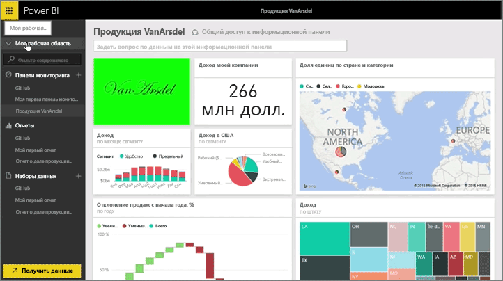
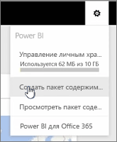
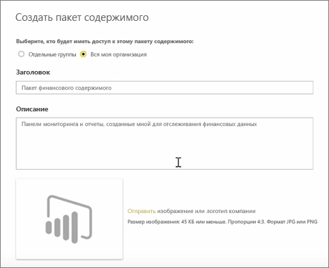
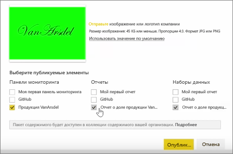
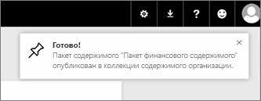

В этом уроке мы создадим *пакет содержимого*, используя существующие артефакты, которые уже имеются в Power BI, а затем предоставим общий доступ к ним коллегам. 

**Моя рабочая область** включает в себя информационную панель, отчет и набор данных. Я хочу, чтобы они были доступны и могли совместно использоваться, как пакет, другими пользователями в организации.

При выборе значка **настройки** (шестеренка в правом верхнем углу службы) отображается используемый объем хранилища, и я могу создать пакет содержимого.

В появившемся диалоговом окне я могу указать, каким пользователям или группам его распространять, а также могу ввести заголовок. Также рекомендуется ввести подробное описание в поле **Описание**, чтобы пользователи, просматривающие пакет содержимого, знали, что в нем содержится или что он предоставляет.

В нижней части диалогового окна у меня есть возможность передать изображение для пакета содержимого. Затем самый важный шаг: я выбираю информационную панель, которую необходимо включить в пакет содержимого, и когда я это делаю, Power BI автоматически выбирает отчет и набор данных, которые используются на информационной панели. Я не могу отменить выбор отчета или набора данных, так как они необходимы для информационной панели, которую я хочу включить в пакет содержимого.

Я также могу выбрать другие информационные панели, отчеты и наборы данных, но я пока не буду этого делать.

При публикации пакет содержимого добавляется в коллекцию содержимого организации.

Перейдем к следующему уроку!

