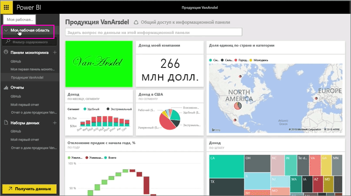
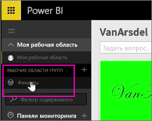
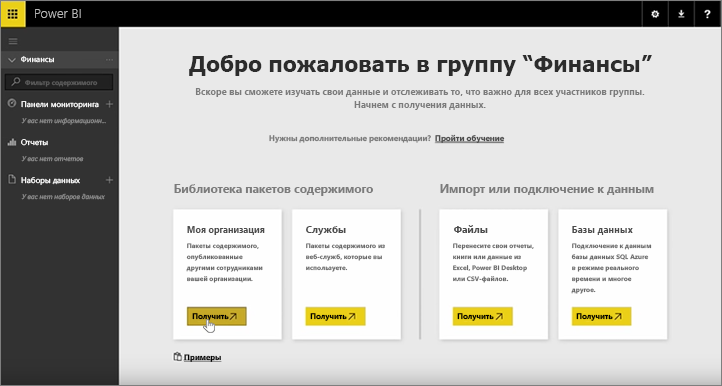
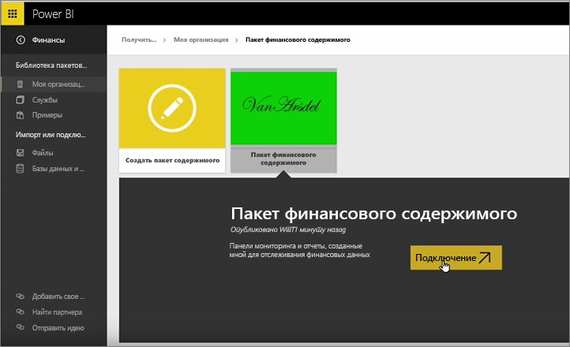
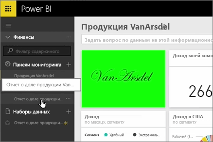
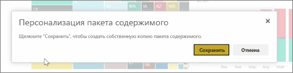
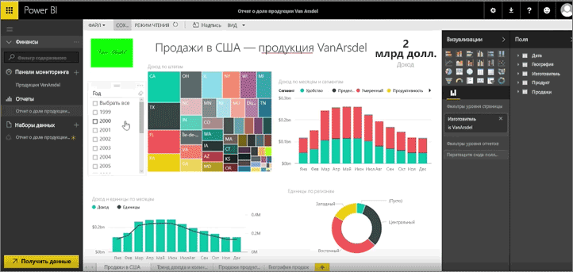

В предыдущих уроках мы уже создали пакет содержимого и группу. В этом уроке мы создадим экземпляр пакета содержимого для всех пользователей в группе.

Откроем страницу "Моя рабочая область"…

…и выберем группу "Финансы", созданную в предыдущем уроке.

В группе еще нет информационных панелей, отчетов или наборов данных. Мы будем использовать созданный пакет содержимого. Чтобы выбрать его, необходимо просмотреть пакеты содержимого из своей организации, а не из сторонних служб.

Мы нашли пакет содержимого, созданный минуту назад. У пакета должно быть понятное имя, описание и изображение, чтобы пользователи могли найти его. Теперь выполним подключение к пакету.

Power BI импортирует информационные панели, отчеты и наборы данных, находящиеся в пакете содержимого.

После выбора набора данных в Power BI отобразится запрос на персонализацию пакета содержимого.

Мы создаем копию пакета содержимого, который можно изменять, и отключаем его от опубликованной версии. Если автор пакета содержимого будет вносить изменения в опубликованную версию, мы не будем автоматически получать эти обновления.

Но мы можем изменить информационную панель, отчет и даже набор данных, если нужно.

Итак, пакеты содержимого — простой способ повторного использования содержимого, созданного другими пользователями в вашей организации.

Перейдем к следующему уроку!

