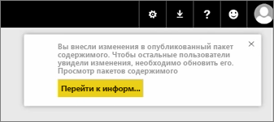
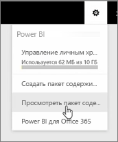

В этом уроке мы отредактируем исходного приложения, который мы создали ранее и см. в разделе, как эти обновления передаются другим пользователям, подключенным к нему.

Я снова в своей рабочей области и редактирую исходную информационную панель.

Каждый раз, когда я изменения панели мониторинга, я получаю это напоминание, что я изменил то, что я предоставили общий доступ другим пользователям в приложении, и мне предлагается обновить общую версию.

Я вернусь к значок "Параметры", а затем выберите **приложение с представлением** чтобы увидеть приложения, я уже опубликовал.

Я вижу созданный мной приложение. Этот небольшой значок сообщает мне, я изменил что-то в приложении, и мне нужно изменить приложение, чтобы другие пользователи могли видеть мои изменения.

При нажатии **Изменить** я возвращаюсь в экран, где я могу отредактировать заголовок и описание, но теперь здесь есть кнопка **Обновить**, которую и требуется выбрать.

Power BI принимает эти изменения и публикует обновленного приложения в коллекцию приложений.

Любому пользователю, подключившемуся к Мое приложение получает сообщение, которое приложение было изменено и пользователю предлагается принять изменения или сохранить старую версию.

Так как владелец приложения, вы можете управлять версий, которые используют ваши коллеги.

