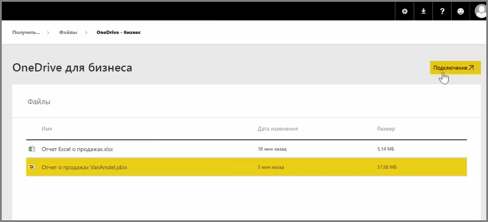
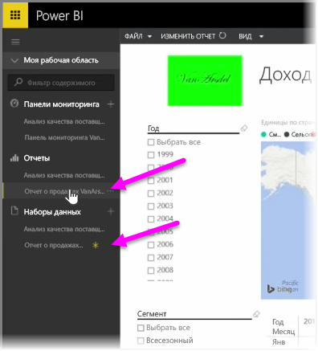

В предыдущей статье мы изучили, как создавать группы, помогающие организации управлять содержимым и совместно использовать содержимое, которое находится в Power BI. Также можно использовать группы Power BI и Office 365 для совместной работы и предоставления общего доступа с помощью **OneDrive для бизнеса**.

Использование OneDrive для бизнеса в качестве источника содержимого для Power BI открывает доступ к целому ряду полезных инструментов, таких как журнал версий. Вы также можете использовать свои файлы совместно с группой Office 365 прямо в OneDrive для бизнеса, чтобы предоставить доступ и разрешить большому числу пользователей работать над одними файлами Power BI или Excel.

Для подключения к PBIX-файлу (Power BI Desktop) в OneDrive для бизнеса выполните вход в службу Power BI и выберите **Получение данных**. В разделе "Импорт" или "Подключение к данным" выберите **Файлы**, а затем выберите **OneDrive для бизнеса**. Выделите нужный файл и нажмите **Подключить**.

Содержимое отобразится на левой панели навигации.

Теперь любые изменения в файле в **OneDrive для бизнеса** будут автоматически отражаться в среде Power BI и записываться в журнал версий.

