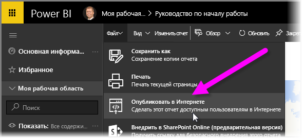
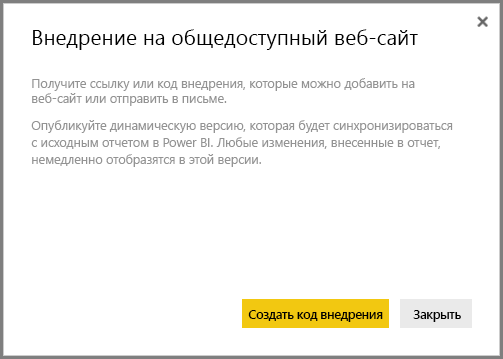
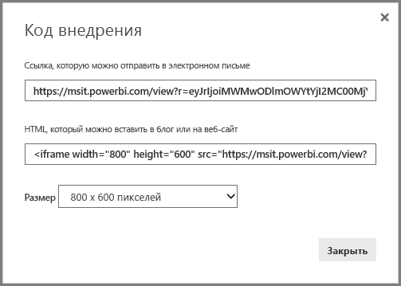
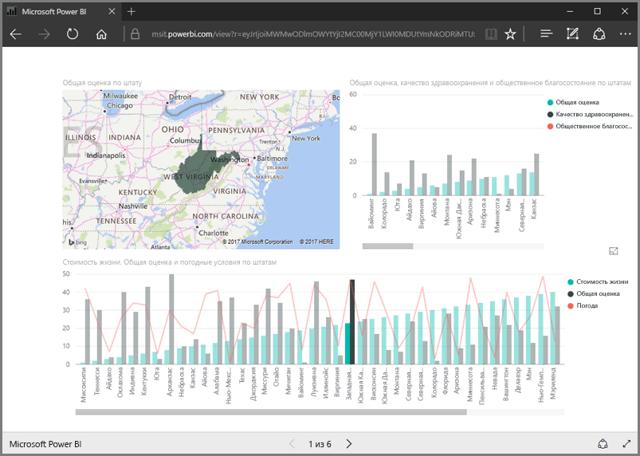
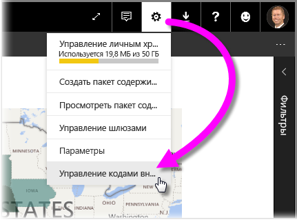
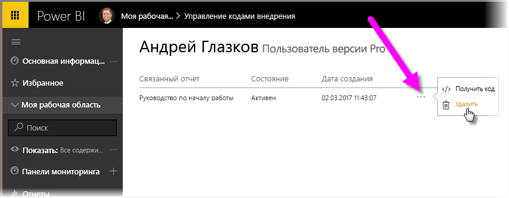

В этом уроке мы узнаем, как предоставить общий доступ к отчету Power BI на веб-странице или по электронной почте, выполнив всего несколько простых действий. Эту функцию Power BI часто называют **Опубликовать в Интернете**. Она проста в использовании и управлении.

В Power BI выберите отчет, к которому нужно предоставить общий доступ, чтобы он отобразился на холсте. Затем выберите в меню параметры **Файл > Опубликовать в Интернете**.

После этого откроется диалоговое окно, в котором сообщается, что вы получите *код внедрения*, позволяющий добавить отчет на веб-сайт или отправить его по электронной почте.

При выборе пункта **Создать код внедрения** в Power BI отображается другое диалоговое окно, в котором еще раз сообщается о совместном использовании данных в Интернете. Убедитесь, что все сделано правильно.

В Power BI отображается диалоговое окно с двумя ссылками:

* ссылка, к которой можно предоставить общий доступ по электронной почте (при переходе по ней отображается отчет в виде веб-страницы);
* HTML-код (ссылка внутри IFrame), позволяющий внедрить отчет непосредственно в веб-страницу.

Для HTML-ссылки можно выбрать внедренный отчет из предопределенных размеров или изменить код IFrame и настроить его размер самостоятельно.

Вы можете просто вставить ссылку для электронной почты в браузер и просмотреть отчет в виде веб-страницы. Вы можете работать с этой веб-страницей точно так же, как и при просмотре отчета в Power BI. На следующих рисунках показана страница **Опубликовать в Интернете** при копировании ее ссылки непосредственно из этого диалогового окна в браузер:

Эту ссылку в IFrame можно также внедрить в запись блога, веб-сайт или Sway.

Хотите удалить созданный код внедрения? Это не проблема. В Power BI в правом верхнем углу экрана щелкните значок **шестеренки** и выберите **Управление кодами внедрения**.

В рабочей области Power BI отобразятся созданные коды внедрения (на приведенном ниже рисунке отображается один из них). Щелкнув многоточие, можно получить код внедрения или полностью удалить его.

Вот и все, что нужно знать о публикации отчета Power BI в Интернете и его совместном использовании. Это просто!

