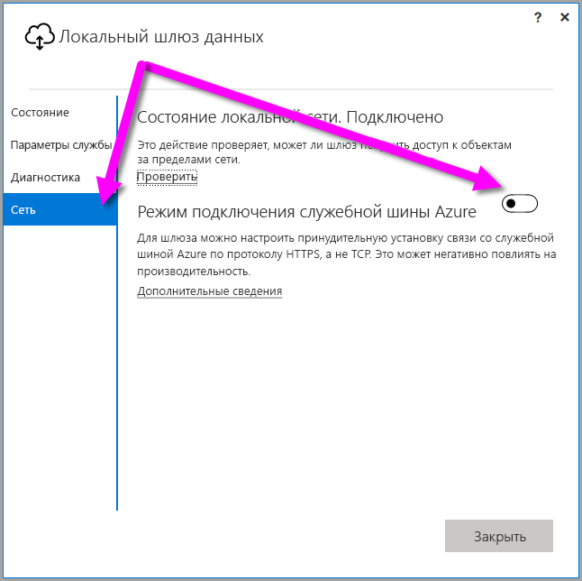
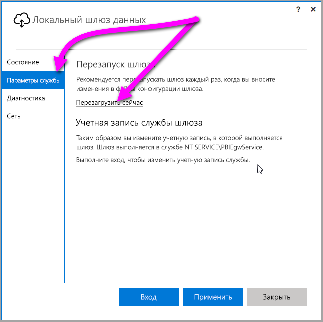

## <a name="sign-in-account"></a>Учетная запись для входа

Пользователи входят в систему с рабочей или учебной учетной записью. Это **учетная запись организации**. Если у вас есть подписка на Office 365 и вы не указали свой реальный рабочий адрес электронной почты, ваша учетная запись может иметь вид nancy@contoso.onmicrosoft.com. Ваша учетная запись хранится в клиенте в каталоге Azure Active Directory (AAD). В большинстве случаев имя участника-пользователя учетной записи AAD совпадает с адресом электронной почты.

## <a name="windows-service-account"></a>Учетная запись служб Windows

Локальный шлюз данных настроен для входа в службы Windows с учетными данными *NT SERVICE\PBIEgwService*. По умолчанию он имеет право входить от имени службы в контексте того компьютера, на котором установлен шлюз. Это не та учетная запись, с помощью которой вы подключаетесь к локальным источникам данных. Также эта учетная запись не совпадает с рабочей или учебной учетной записью, с которой вы входите в облачные службы.

> [!NOTE]
> Если вы выбрали личный режим, учетная запись служб Windows настраивается отдельно.

Если у вас возникнут проблемы с аутентификацией через прокси-сервер, попробуйте сменить учетную запись службы Windows на учетную запись пользователя домена или управляемой службы. Дополнительные сведения см. в статье [о конфигурации прокси-сервера](../service-gateway-proxy.md#changing-the-gateway-service-account-to-a-domain-user).

## <a name="ports"></a>Порты

Шлюз создает исходящее подключение к служебной шине Azure. Связь осуществляется через исходящие порты TCP 443 (по умолчанию), 5671, 5672 и с 9350 по 9354.  Шлюзу не требуются входящие порты.

Рекомендуется добавить IP-адреса для региона, в котором хранятся ваши данные, в список разрешений брандмауэра. Можно скачать еженедельно обновляемый [список IP-адресов центров данных Microsoft Azure](https://www.microsoft.com/download/details.aspx?id=41653). Шлюз будет взаимодействовать со служебной шиной Azure, используя IP-адрес и полное доменное имя (FQDN). При принудительной установке связи по протоколу HTTPS шлюз будет использовать только полное доменное имя, поэтому он не будет устанавливать связь по IP-адресам.

> [!NOTE]
> IP-адреса в списке адресов центров данных Azure указаны в формате CIDR. Например, запись 10.0.0.0/24 не означает диапазон адресов с 10.0.0.0 по 10.0.0.24. Ознакомьтесь с дополнительными сведениями о [формате CIDR](http://whatismyipaddress.com/cidr).

Вот список полных доменных имен, которые используются шлюзом.

| Имена доменов | Исходящие порты | Описание |
| --- | --- | --- |
| *.download.microsoft.com |80 |HTTP, используемый для скачивания установщика. |
| *.powerbi.com |443 |HTTPS |
| *.analysis.windows.net |443 |HTTPS |
| *.login.windows.net |443 |HTTPS |
| *.servicebus.windows.net |5671-5672 |Расширенный протокол управления очередью сообщений (AMQP) |
| *.servicebus.windows.net |443, 9350-9354 |Прослушиватели для ретранслятора служебной шины по протоколу TCP (порт 443 требуется для получения маркера контроля доступа). |
| *.frontend.clouddatahub.net |443 |HTTPS |
| *.core.windows.net |443 |HTTPS |
| login.microsoftonline.com |443 |HTTPS |
| *.msftncsi.com |443 |Используется для проверки подключения к Интернету, если шлюз недоступен для службы Power BI. |
| *.microsoftonline p.com |443 |Используется для проверки подлинности в зависимости от конфигурации. |

> [!NOTE]
> Трафик, передаваемый на сайты visualstudio.com или visualstudioonline.com, нужен для работы компонента Application Insights. Этот трафик не влияет на функционирование шлюза.

## <a name="forcing-https-communication-with-azure-service-bus"></a>Принудительная установка связи по HTTPS со служебной шиной Azure

Для шлюза можно настроить принудительную установку связи со служебной шиной Azure по протоколу HTTPS, а не TCP. использование HTTPS может повлиять на производительность. Для такой настройки измените в файле *Microsoft.PowerBI.DataMovement.Pipeline.GatewayCore.dll.config* значение `AutoDetect` на значение `Https`, как показано во фрагменте кода ниже. По умолчанию этот файл располагается здесь: *C:\Program Files\On-premises data gateway*.

```
<setting name="ServiceBusSystemConnectivityModeString" serializeAs="String">
    <value>Https</value>
</setting>
```

В значении параметра *ServiceBusSystemConnectivityModeString* учитывается регистр. Допустимые значения: *AutoDetect* и *Https*.

Кроме того, для шлюза можно настроить принудительный режим, описанный выше, с помощью пользовательского интерфейса шлюза. В пользовательском интерфейсе шлюза выберите раздел **Сеть**, а затем задайте для **режима подключения к служебной шине Azure** значение **Включено**.



После внесения изменений появится кнопка **Применить**. После ее нажатия *служба шлюза в ОС Windows* автоматически перезапустится, чтобы изменения вступили в силу.

В будущем, чтобы перезапустить *службу шлюза в ОС Windows*, в диалоговом окне пользовательского интерфейса выберите раздел **Параметры службы**, а затем щелкните *Перезагрузить сейчас*.



## <a name="support-for-tls-1112"></a>Поддержка протокола TLS 1.1 и 1.2

Локальный шлюз данных по умолчанию использует протокол TLS 1.1 или 1.2 для взаимодействия со **службой Power BI**. В предыдущих версиях локального шлюза данных по умолчанию используется TLS 1.0. Поддержка TLS 1.0 будет прекращена 15 марта 2018 г., в том числе станет невозможной связь шлюза со **службой Power BI** через TLS 1.0. Необходимо обновить все локальные установки шлюза данных, чтобы обеспечить их работоспособность.

Обратите внимание, что до 1 ноября сохранится поддержка протокола TLS 1.0 на локальном шлюзе данных, который будет использовать его в качестве резервного механизма. Чтобы при передаче всего трафика шлюза использовался протокол TLS 1.1 или 1.2 (и чтобы прекратить использование шлюзом TLS 1.0), необходимо добавить или изменить следующие разделы реестра на компьютере, где запущена служба шлюза.

        [HKEY_LOCAL_MACHINE\SOFTWARE\Microsoft\.NETFramework\v4.0.30319]"SchUseStrongCrypto"=dword:00000001
        [HKEY_LOCAL_MACHINE\SOFTWARE\Wow6432Node\Microsoft\.NETFramework\v4.0.30319]"SchUseStrongCrypto"=dword:00000001

> [!NOTE]
> При добавлении или изменении этих разделов реестра обновления распространяются на все приложения .NET. Сведения об изменениях реестра, которые влияют на использование TLS в других приложениях, см. в описании [параметров реестра для протокола TLS](https://docs.microsoft.com/windows-server/security/tls/tls-registry-settings).

## <a name="how-to-restart-the-gateway"></a>Как перезапустить шлюз

Шлюз работает в качестве службы Windows. Его можно запустить и остановить, как и любую службу Windows. Вот как это можно сделать из командной строки.

1. На компьютере, где работает шлюз, откройте командную строку администратора.
2. Остановить службу можно с помощью следующей команды:
   
   net stop PBIEgwService
3. Запустить службу можно с помощью следующей команды:
   
   net start PBIEgwService

