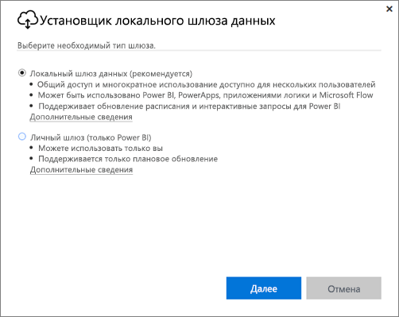
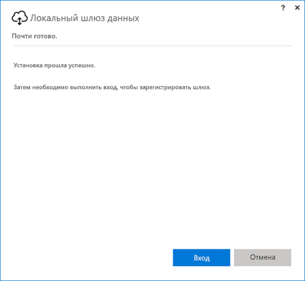
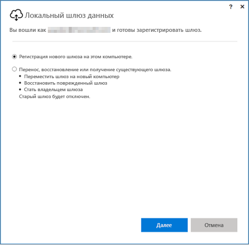
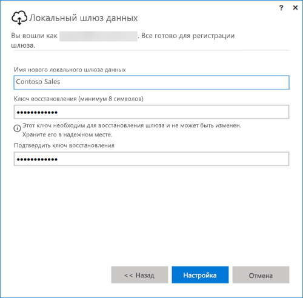

## Скачивание локального шлюза данных
Шлюз устанавливается и запускается на вашем компьютере. Рекомендуется устанавливать шлюз на компьютере, который может работать без перерыва.

> [!NOTE]
> Шлюз поддерживается только в 64-разрядных операционных системах Windows.
> 
> 

Для Power BI необходимо сначала выбрать режим работы шлюз.

* **Локальный шлюз данных**: в этом режиме со шлюзом может работать много пользователей. Его можно использовать для доступа к службам Power BI, PowerApps, Flow и Logic Apps. Для Power BI в этом режиме поддерживаются запланированное обновление и подключения DirectQuery.
* **Личный**: в этом режиме шлюз поддерживает только Power BI, и с ним может работать только один пользователь без какой-либо административной настройки. Такой шлюз можно использовать только для обновления по запросу и запланированного обновления. Если выбрать этот вариант, запустится установка персонального шлюза.

При установке шлюза в том или ином режиме следует помнить о следующем:

* Обоим шлюзам требуется 64-разрядная ОС Windows.
* Шлюз нельзя устанавливать на контроллер домена.
* Вы можете установить не более двух локальных шлюзов данных на одном компьютере: по одному шлюзу в каждом режиме (персональном и стандартном). 
* На одном компьютере не может быть два шлюза, работающих в одном режиме.
* Можно установить несколько локальных шлюзов данных на разных компьютерах и управлять ими с помощью одного интерфейса управления шлюзами Power BI (за исключением шлюза в персональном режиме, см. пункт ниже).
* У каждого пользователя Power BI может быть только один шлюз, работающий в персональном режиме. Если для пользователя установить еще один шлюз в персональном режиме, даже на другом компьютере, последняя установленная версия заменит предыдущую.

Вот несколько моментов, которые следует учесть, прежде чем устанавливать шлюз.

* Если вы установите шлюз на ноутбук, то в случае его отключения, потери соединения с Интернетом или перехода в спящий режим шлюз перестанет работать и данные в облачной службе не будут синхронизироваться с локальными данными.
* Если компьютер подключен к беспроводной сети, шлюз может работать медленно, и в результате синхронизация облачных данных с локальными будет занимать больше времени.

После установки шлюза потребуется выполнить вход с рабочей или учебной учетной записью.

После входа вам будет предложено настроить новый шлюз либо выполнить миграцию, восстановление или перенос существующего.

## Настройка нового шлюза
1. Введите **имя** шлюза.
2. Укажите **ключ восстановления**. Он должен содержать не менее 8 знаков.
3. Выберите **Настройка**.

> [!NOTE]
> Ключ восстановления потребуется в случае, если вы захотите выполнить миграцию, восстановление или перенос шлюза. Храните этот ключ в надежном месте.
> 
> 

### Миграция, восстановление и перенос существующего шлюза
Выберите шлюз, который хотите восстановить, и укажите ключ восстановления, который использовали при его создании.

### Подключенный локальный шлюз данных
Настроив шлюз, вы сможете подключаться с его помощью к локальным источникам данных.

Если он предназначен для работы с Power BI, вам потребуется добавить в него свои источники данных из службы Power BI. Это делается в разделе **Управление шлюзами**. Дополнительные сведения см. в статьях об управлении источниками данных.

Для работы с PowerApps вам понадобится выбрать шлюз для настроенного подключения к поддерживаемым источникам данных. Для работы со службами Flow и Logic Apps дополнительные настройки не требуются — шлюз можно использовать с локальными подключениями.

