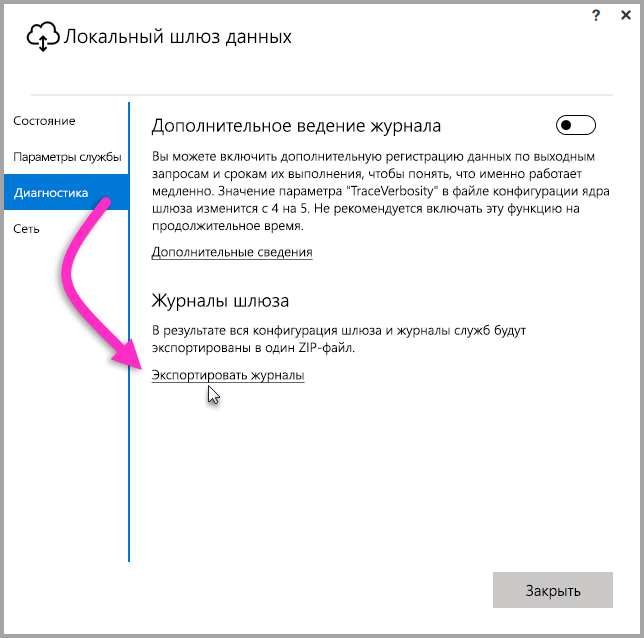
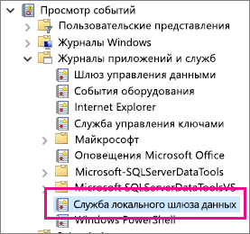

## Инструменты для устранения неполадок
<a name="logs" />

### Сбор журналов из конфигуратора шлюзов
Для шлюза доступно несколько разных журналов. Всегда начинайте проверку с журналов. Проще всего собирать журналы после установки шлюза через пользовательский интерфейс. В пользовательском интерфейсе **локального шлюза данных** выберите **Диагностика** и щелкните ссылку **Экспортировать журналы** в нижней части страницы, как показано на изображении ниже.

**Журналы установщика**

    %localappdata%\Temp\On-premises_data_gateway_*.log

**Журналы конфигурации**

    %localappdata%\Microsoft\on-premises data gateway\GatewayConfigurator*.log

**Журналы службы локального шлюза данных**

    C:\Users\PBIEgwService\AppData\Local\Microsoft\on-premises data gateway\Gateway*.log

### Журналы событий
Журналы событий **службы локального шлюза данных** расположены в разделе **Журналы приложения и служб**.

<a name="fiddler" />

### Трассировка Fiddler
[Fiddler](http://www.telerik.com/fiddler) — это бесплатный инструмент от Telerik, отслеживающий трафик HTTP.  Вы можете просматривать всю работу службы Power BI с клиентского компьютера. Это позволяет найти ошибки и другие связанные сведения.

