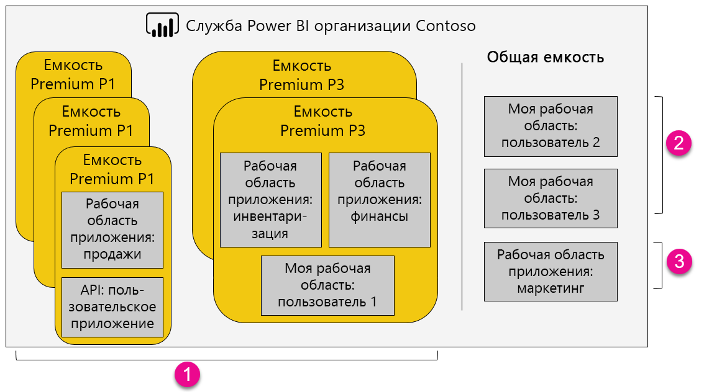

1. Элементы в емкости Premium
   
   * Для доступа к рабочим областям приложения (в качестве участников или администраторов) и публикации приложений требуется лицензия Power BI Pro.
   * Читателями приложения могут быть пользователи с бесплатной лицензией или лицензией Power BI Pro.
   * Для предоставления общего доступа требуется лицензия Power BI Pro, но получатели могут использовать бесплатную лицензию или лицензию Power BI Pro.
   * Независимо от имеющейся лицензии (Power BI Pro или бесплатная), получатели панели мониторинга могут настраивать оповещения об изменении данных.
   * Интерфейсы REST API для внедрения используют учетную запись службы с лицензией Power BI Pro, а не учетную запись пользователя.
2. Моя рабочая область в общей емкости
   
   * Для предоставления общего доступа требуется лицензия Pro. Получателям также требуется лицензия Pro.
3. Рабочие области приложений в общей емкости
   
   * Для использования любого приложения требуется лицензия Pro.

