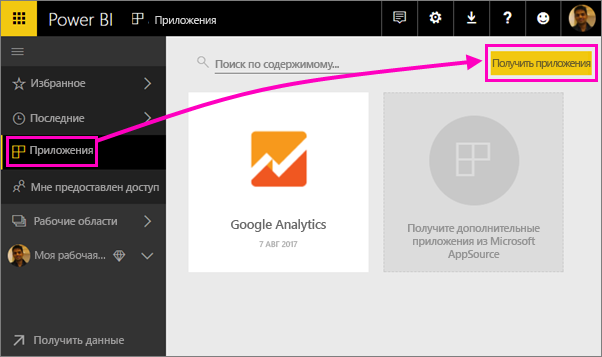
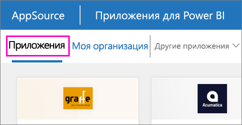

1. Выберите **Приложения** в левой области навигации, а затем щелкните **Получить приложения** в правом верхнем углу.
   
     
2. В AppSource на вкладке **Приложения** выполните поиск нужной службы.
   
    

